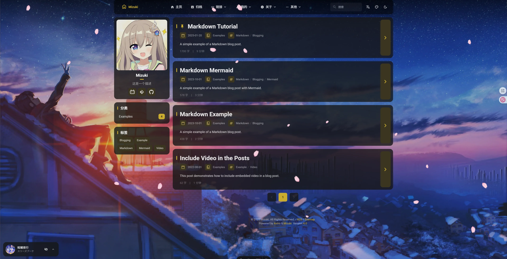

# 🌸 Mizuki  
 
 


[](https://opensource.org/licenses/MIT)




一個現代化、功能豐富的靜態部落格模板，基於 [Astro](https://astro.build) 構建，具有先進的功能和精美的設計。

[**🖥️ 線上演示**](https://mizuki.mysqil.com/)
[**📝 使用者文檔**](https://docs.mizuki.mysqil.com/)

🌏 README 語言
[**English**](../README.md) /
[**中文**](../README.zh.md) /
[**日本語**](./README.ja.md) /
[**中文繁体**](./README.tw.md) /

## 🆕 v4.9 版本更新
- **Pio 看板娘整合**：整合了 Pio 看板娘，提供可愛的互動角色，增強使用者互動體驗。
- **高度可配置**：支援在 `src/config.ts` 中進行詳細配置，包括模型路徑、位置、尺寸、對話內容等，滿足個性化需求。
- **無刷新跳轉**：看板娘的返回首頁功能現在使用主題自帶的 Swup 無刷新跳轉，提供更流暢、無縫的頁面切換體驗。

## 🆕 v4.3 版本更新
- **番劇頁面：** 重構了更可愛好看的番劇頁面，包括番劇列表、番劇詳情和番劇時間軸。
- **相冊頁面：** 重構了相冊頁面，使用分頁+資料夾數據索引方案。

## 🆕 v3.4 版本更新
- **新增頁面：** 添加了項目展示、技能展示和時間線專屬頁面，用於展示您的工作、專業技能和成長歷程。
- **下拉選單修復：** 解決了下拉選單點擊時出現邊框輪廓的問題，提升了界面一致性。
- **搜尋功能優化：** 增強了搜尋功能的效能和準確性。
- **底部HTML注入：** 引入了新功能，允許在頁面底部注入自定義HTML內容，提供更大的靈活性。

## 🆕 v3.3 版本更新
- **Mermaid 語法支援：** 添加了對 Mermaid 圖表語法的支援，現在可以在 Markdown 中直接嵌入流程圖、序列圖、甘特圖等。
- **Umami 訪問統計：** 添加了對 Umami 訪問統計的支援，可以輕鬆整合網站訪問數據分析。


### 🔧 元件配置系統重構
- **統一配置架構：** 全新的模組化元件配置體系，支援動態元件管理和順序配置
- **配置驅動的元件載入：** 重構 SideBar 元件，實現完全基於配置的元件載入機制
- **統一控制開關：** 移除音樂播放器和公告元件的獨立 enable 開關，統一由 sidebarLayoutConfig 控制
- **響應式佈局適配：** 元件支援響應式佈局，可根據裝置類型自動調整顯示

### 📐 佈局系統優化
- **側邊欄位置動態調整：** 支援左右側邊欄切換，佈局自動適配
- **文章目錄智能定位：** 當側邊欄在右側時，文章導航自動移至左側，提供更好的閱讀體驗
- **網格佈局改進：** 優化 CSS Grid 佈局，解決容器寬度異常問題

### 🎛️ 配置文件格式規範
- **標準化配置格式：** 創建統一的元件配置文件格式規範
- **類型安全：** 完善的 TypeScript 類型定義，確保配置的類型安全
- **可擴展性：** 支援自定義元件類型和配置選項

### 🧹 程式碼優化
- **測試文件清理：** 移除未使用的測試配置和依賴，減少專案體積
- **程式碼結構優化：** 改進元件架構，提升程式碼可維護性
- **效能提升：** 優化元件載入邏輯，提升頁面渲染效能

---

## ✨ 功能特性

### 🎨 設計與界面
- [x] 基於 [Astro](https://astro.build) 和 [Tailwind CSS](https://tailwindcss.com) 構建
- [x] 使用 [Swup](https://swup.js.org/) 實現流暢的動畫和頁面過渡
- [x] 明暗主題切換，支援系統偏好檢測
- [x] 可自定義主題色彩和動態橫幅輪播
- [x] 全屏背景圖片，支援輪播、透明度和模糊效果
- [x] 全裝置響應式設計
- [x] 使用 JetBrains Mono 字體的優美排版

### 🔍 內容與搜尋
- [x] 基於 [Pagefind](https://pagefind.app/) 的高級搜尋功能
- [x] [增強的 Markdown 功能](#-markdown-擴展語法)，支援語法高亮
- [x] 互動式目錄，支援自動滾動
- [x] RSS 訂閱生成
- [x] 閱讀時間估算
- [x] 文章分類和標籤系統

### 🌐 國際化支援
- [x] **多語言支援**，即時翻譯功能
- [x] **自動語言檢測**，基於使用者偏好
- [x] **客戶端翻譯**，由 Edge Translate 驅動
- [x] 支援 10+ 種語言（中文、英文、日文、韓文、西班牙文等）

### 📱 特色頁面
- [x] **追番頁面** - 追蹤動畫觀看進度和評分
- [x] **友鏈頁面** - 精美卡片展示朋友網站
- [x] **日記頁面** - 分享生活瞬間，類似社交媒體
- [x] **歸檔頁面** - 有序的文章時間線視圖
- [x] **關於頁面** - 可自定義的個人介紹

### 🛠 技術特性
- [x] **增強程式碼區塊**，基於 [Expressive Code](https://expressive-code.com/)
- [x] **數學公式支援**，KaTeX 渲染
- [x] **圖片優化**，PhotoSwipe 畫廊整合
- [x] **SEO 優化**，包含網站地圖和元標籤
- [x] **效能優化**，懶加載和快取機制
- [x] **評論系統**，支援 Twikoo 整合

## 🚀 快速開始

### 📦 安裝

1. **克隆儲存庫：**
   ```bash
   git clone https://github.com/matsuzaka-yuki/mizuki.git
   cd mizuki
   ```

2. **安裝依賴：**
   ```bash
   # 如果沒有安裝 pnpm，先安裝
   npm install -g pnpm
   
   # 安裝專案依賴
   pnpm install
   ```

3. **配置部落格：**
   - 編輯 `src/config.ts` 自定義部落格設置
   - 更新網站資訊、主題色彩、橫幅圖片和社交連結
   - 配置翻譯設置和特色頁面功能

4. **啟動開發伺服器：**
   ```bash
   pnpm dev
   ```
   部落格將在 `http://localhost:4321` 可用

### 📝 內容管理

- **創建新文章：** `pnpm new-post <檔案名>`
- **編輯文章：** 修改 `src/content/posts/` 中的檔案
- **自定義頁面：** 編輯 `src/content/spec/` 中的特殊頁面
- **添加圖片：** 將圖片放在 `src/assets/` 或 `public/` 中

### 🚀 部署

將部落格部署到任何靜態託管平台：

- **Vercel：** 連接 GitHub 儲存庫到 Vercel
- **Netlify：** 直接從 GitHub 部署
- **GitHub Pages：** 使用包含的 GitHub Actions 工作流
- **Cloudflare Pages：** 連接您的儲存庫

部署前，請在 `astro.config.mjs` 中更新 `site` URL。

## 📝 文章前言格式

```yaml
---
title: 我的第一篇部落格文章
published: 2023-09-09
description: 這是我新部落格的第一篇文章。
image: ./cover.jpg
tags: [標籤1, 標籤2]
category: 前端
draft: false
pinned: false
lang: zh-TW      # 僅當文章語言與 config.ts 中的網站語言不同時設置
---
```

### Frontmatter 欄位說明

- **title**: 文章標題（必需）
- **published**: 發布日期（必需）
- **description**: 文章描述，用於 SEO 和預覽
- **image**: 封面圖片路徑（相對於文章檔案）
- **tags**: 標籤陣列，用於分類
- **category**: 文章分類
- **draft**: 設置為 `true` 在生產環境中隱藏文章
- **pinned**: 設置為 `true` 將文章置頂
- **lang**: 文章語言（僅當與網站預設語言不同時設置）

### 置頂文章功能

`pinned` 欄位允許您將重要文章置頂到部落格列表的頂部。置頂文章將始終顯示在普通文章之前，無論其發布日期如何。

**使用方法：**
```yaml
pinned: true  # 將此文章置頂
pinned: false # 普通文章（預設）
```

**排序規則：**
1. 置頂文章優先顯示，按發布日期排序（最新在前）
2. 普通文章隨後顯示，按發布日期排序（最新在前）

## 🧩 Markdown 擴展語法

Mizuki 支援超越標準 GitHub Flavored Markdown 的增強功能：

### 📝 增強寫作
- **提示框：** 使用 `> [!NOTE]`、`> [!TIP]`、`> [!WARNING]` 等創建精美的標註框
- **數學公式：** 使用 `$行內$` 和 `$$塊級$$` 語法編寫 LaTeX 數學公式
- **程式碼高亮：** 高級語法高亮，支援行號和複製按鈕
- **GitHub 卡片：** 使用 `::github{repo="使用者/儲存庫"}` 嵌入儲存庫卡片

### 🎨 視覺元素
- **圖片畫廊：** 自動 PhotoSwipe 整合，支援圖片查看
- **可折疊部分：** 創建可展開的內容區塊
- **自定義元件：** 使用特殊指令增強內容

### 📊 內容組織
- **目錄：** 從標題自動生成，支援平滑滾動
- **閱讀時間：** 自動計算和顯示
- **文章元數據：** 豐富的前言支援，包含分類和標籤

## ⚡ 命令

所有命令都在專案根目錄運行：

| 命令                       | 操作                                    |
|:---------------------------|:---------------------------------------|
| `pnpm install`             | 安裝依賴                               |
| `pnpm dev`                 | 在 `localhost:4321` 啟動本地開發伺服器 |
| `pnpm build`               | 構建生產網站到 `./dist/`               |
| `pnpm preview`             | 在部署前本地預覽構建                   |
| `pnpm check`               | 運行 Astro 錯誤檢查                    |
| `pnpm format`              | 使用 Biome 格式化程式碼                |
| `pnpm lint`                | 檢查並修復程式碼問題                   |
| `pnpm new-post <檔案名>`   | 創建新部落格文章                       |
| `pnpm astro ...`           | 運行 Astro CLI 命令                    |

## 🎯 配置指南

### 🔧 基礎配置

編輯 `src/config.ts` 自定義您的部落格：

```typescript
export const siteConfig: SiteConfig = {
  title: "您的部落格名稱",
  subtitle: "您的部落格描述",
  lang: "zh-TW", // 或 "zh-CN"、"en"、"ja" 等
  themeColor: {
    hue: 210, // 0-360，主題色調
    fixed: false, // 隱藏主題色選擇器
  },
  translate: {
    enable: true, // 啟用翻譯功能
    service: "client.edge", // 翻譯服務
    defaultLanguage: "chinese_traditional",
  },
  banner: {
    enable: true,
    src: ["assets/banner/1.webp"], // 橫幅圖片
    carousel: {
      enable: true,
      interval: 0.8, // 秒
    },
  },
};
```

### 📱 特色頁面配置

- **追番頁面：** 在 `src/pages/anime.astro` 中編輯動畫列表
- **友鏈頁面：** 在 `src/content/spec/friends.md` 中編輯朋友數據
- **日記頁面：** 在 `src/pages/diary.astro` 中編輯動態
- **關於頁面：** 在 `src/content/spec/about.md` 中編輯內容

## ✏️ 貢獻

我們歡迎貢獻！請隨時提交問題和拉取請求。

1. Fork 儲存庫
2. 創建功能分支 (`git checkout -b feature/amazing-feature`)
3. 提交更改 (`git commit -m 'Add some amazing feature'`)
4. 推送到分支 (`git push origin feature/amazing-feature`)
5. 打開拉取請求

## 📄 許可證

本專案基於 MIT 許可證 - 查看 [LICENSE](../LICENSE) 檔案了解詳情。

## 🙏 致謝

- 基於原始 [Fuwari](https://github.com/saicaca/fuwari) 模板
- 使用 [Astro](https://astro.build) 和 [Tailwind CSS](https://tailwindcss.com) 構建
- 靈感來源於 [Yukina](https://github.com/WhitePaper233/yukina) - 一個美麗優雅的部落格模板
- 翻譯功能由 [translate](https://gitee.com/mail_osc/translate) 提供支援 - AI i18n 自動HTML翻譯解決方案
- 圖標來自 [Iconify](https://iconify.design/)

### 特別感謝

- **[Yukina](https://github.com/WhitePaper233/yukina)** - 感謝提供設計靈感和創意，幫助塑造了這個專案。Yukina 是一個優雅的部落格模板，展現了出色的設計原則和使用者體驗。
- **[translate](https://gitee.com/mail_osc/translate)** - 感謝提供創新的AI驅動i18n解決方案，僅需兩行JavaScript程式碼即可實現HTML自動翻譯。這個開源工具讓多語言支援變得極其簡單高效。

---

⭐ 如果您覺得這個專案有幫助，請考慮給它一個星標！