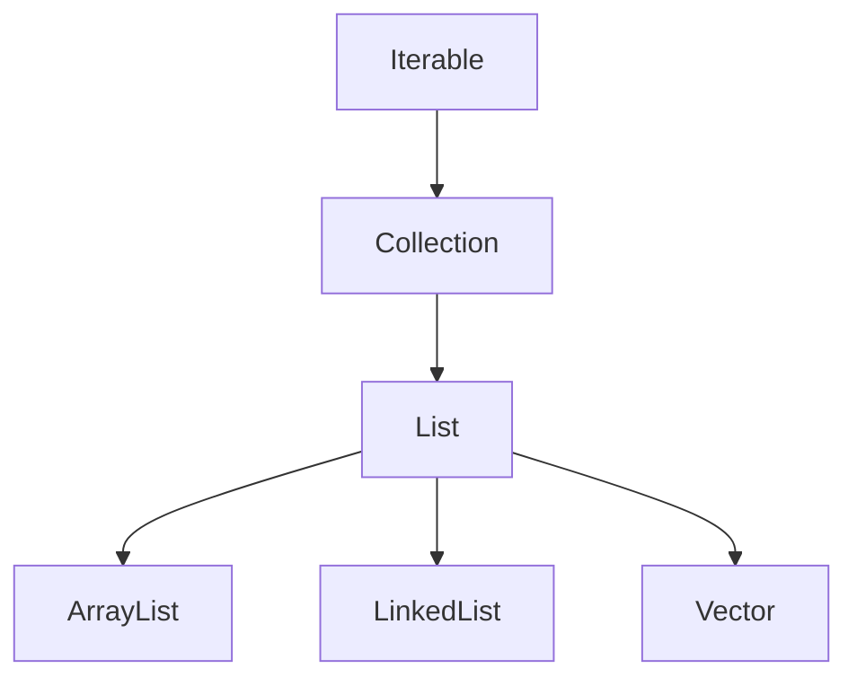
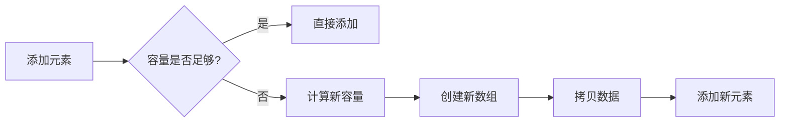
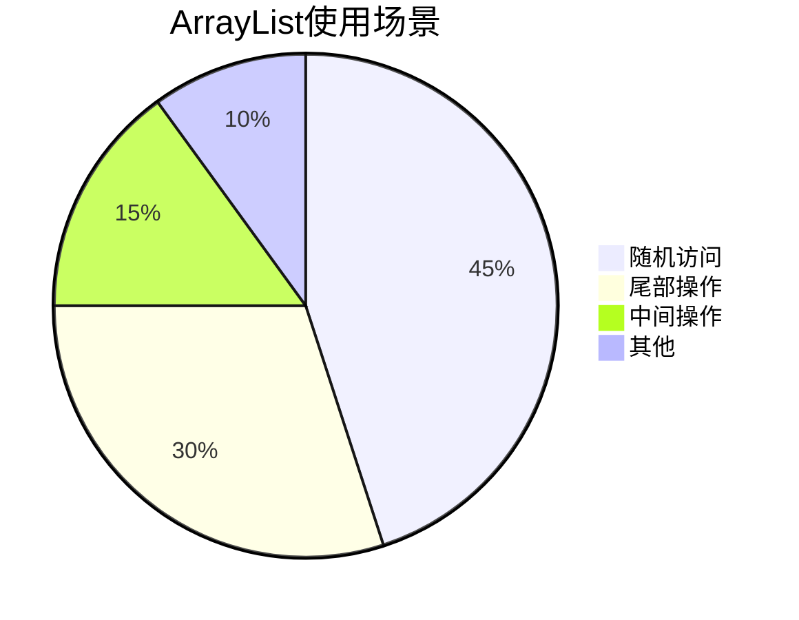

> **[<font face="STCAIYUN" size =  5 color = #386b44ff>数</font><font face="STCAIYUN" size =  5 color = #386b44ff>据</font><font face="STCAIYUN" size =  5 color = #386b44ff>结</font><font face="STCAIYUN" size =  5 color = #386b44ff>构</font><font face="STCAIYUN" size =  5 color = #386b44ff>专</font><font face="STCAIYUN" size =  5 color = #386b44ff>栏 </font>⬅(click)](https://blog.csdn.net/weixin_46491509/category_12935100.html?spm=1001.2014.3001.5482)**

---
## 🌟 前言：为什么我们需要List和ArrayList？

在日常开发中，我们经常需要处理一组数据。想象一下，如果你要管理一个班级的学生名单，或者处理电商网站的商品列表，你会怎么做？Java集合框架中的List和ArrayList就是为解决这类问题而生的利器！

本文将带你深入探索List接口和ArrayList实现类的奥秘，通过丰富的示例和直观的图示，让你彻底掌握它们的用法和原理。

---

## 🧩 第一部分：List接口全景图

### 1. 什么是List？

List是Java集合框架中的一个**接口**，它继承自Collection接口，代表一个**有序的、可重复的**元素序列。

```java
public interface List<E> extends Collection<E> {
    // 一系列方法定义
}
```

#### 🎯 List的核心特性：
- **有序性**：元素按照插入顺序排列
- **可重复**：允许存储相同的元素
- **索引访问**：可以通过下标直接访问元素

### 2. List的继承体系（思维导图）



### 3. List常用方法速查表

| 方法签名 | 功能描述 | 时间复杂度 |
|---------|---------|-----------|
| `boolean add(E e)` | 尾部添加元素 | O(1) |
| `void add(int index, E element)` | 指定位置插入 | O(n) |
| `E get(int index)` | 获取指定位置元素 | O(1) |
| `E set(int index, E element)` | 修改指定位置元素 | O(1) |
| `E remove(int index)` | 删除指定位置元素 | O(n) |
| `int size()` | 返回元素个数 | O(1) |
| `boolean contains(Object o)` | 判断是否包含元素 | O(n) |

---

## 🚀 第二部分：ArrayList深度剖析

### 1. ArrayList的底层原理

ArrayList是基于**动态数组**实现的顺序表，它自动处理扩容问题，让我们可以专注于业务逻辑。

```java
// 底层核心数组
transient Object[] elementData;
// 实际元素数量
private int size;
```

### 2. ArrayList的构造方法对比

| 构造方法 | 说明 | 初始容量 |
|---------|------|---------|
| `ArrayList()` | 无参构造 | 10 |
| `ArrayList(int initialCapacity)` | 指定初始容量 | 自定义 |
| `ArrayList(Collection<? extends E> c)` | 从集合构造 | 集合大小 |

### 3. 动态扩容机制揭秘（流程图）



**扩容规则**：
- 首次添加元素时扩容到10
- 后续按1.5倍增长（`int newCapacity = oldCapacity + (oldCapacity >> 1)`）

### 4. ArrayList的三种遍历方式

```java
List<String> list = new ArrayList<>(Arrays.asList("A", "B", "C"));

// 1. for循环+下标
for (int i = 0; i < list.size(); i++) {
    System.out.println(list.get(i));
}

// 2. 增强for循环
for (String s : list) {
    System.out.println(s);
}

// 3. 迭代器
Iterator<String> it = list.iterator();
while (it.hasNext()) {
    System.out.println(it.next());
}
```

---
##  实战应用1：
### 🎲自己实现一个MyArrayList（只包含String非泛型）

```java
import java.util.ArrayList;
import java.util.Iterator;

public class MyArrayList extends ArrayList {

    //通过这个数组来去表示顺去表中的元素
    private String[] data = null;
    //表示有效元素的个数
    private int size = 0;

    //无参构造方法
    public MyArrayList() {
        //默认容量初始容量为10
        data = new String[10];
    }

    //有参构造方法
    public MyArrayList(int capacity) {
        if (capacity <= 10) {
            capacity = 10;
        }
        data = new String[capacity];
    }

    //扩容方法
    public void resize() {
        //1.创建一个更长的数组，长度是之前的1.5倍

        //String[] newData = new String[(int) (data.length * 1.5)];     //一种写法
        String[] newData = new String[data.length + (data.length >> 1)];  //右移一位相当于除以2
        for (int i = 0;i<size;i++){

            //2.把旧数组的元素拷贝进新数组
            newData[i] = data[i];
        }
        //3.使用新数组代替旧数组
        //因为data和newData都是引用类型，此操作相当于把newData的地址赋值到data，data指向新的地址
        //同时因为旧数组没有地方储存，触发垃圾回收机制
        data = newData;


    }

    // 实现指定下标删除操作
    public String remove(int index) {
        String del = data[index];
        if (index < 0 || index >= size) {
            throw new IndexOutOfBoundsException("Index: " + index + ", Size: " + size);
        }
        for (int i = index; i < size-1; i++) {
            data[i] = data[i + 1];
        }
        size--;
        return del;
    }

    // 实现指定元素删除操作
    public boolean remove(String element) {
        int removePos = 0;
        for (removePos = 0; removePos < size; removePos++) {
            //说明找到了
            if (data[removePos].equals(element)) {
                break;
            }
        }
        //上述循环结束有两种可能
        if(removePos == size){
            //说明没找到removePos和size相等了
            return false;
        }
        //进行搬运操作
//        for (int i = removePos; i < size-1; i++) {
//            data[i] = data[i+1];
//        }
//        size--;

        //代码复用优化
        remove(removePos);
        return true;
    }


    //实现尾插操作
    public void add(String item) {

        //实现扩容
        if(size >= data.length) {
            //触发扩容
            resize();
        }

        data[size] = item;
        size++;
    }

    //实现指定位置插入
    public void add(int index, String item) {
        //判断index是否合法
        //此处是否要写作index<=0或者index>=size，边界值都需要重点讨论
        if (index < 0 || index > size) {
            throw new IndexOutOfBoundsException("Index: " + index + ", Size: " + size);
        }
        //判断是否触发扩容
        if (size >= data.length) {
            resize();
        }
        //把元素放在index上，进行元素搬运
       for (int i = size-1; i >= index; i--) {
           data[i + 1] = data[i];
       }
       //把新元素放在index位置上
       data[index] = item;
       size++;
    }

    //实现get操作
    public String get(int index) {
        //记住一定不能缺合法性判定
        if (index < 0 || index >= size) {
            throw new IndexOutOfBoundsException("Index: " + index + ", Size: " + size);
        }
        return data[index];
    }

    //实现set操作
    public void set(int index, String item) {
        //记住一定不能缺合法性判定
        if (index < 0 || index >= size) {
            throw new IndexOutOfBoundsException("Index: " + index + ", Size: " + size);
        }
        data[index] = item;
    }


    //实现clear操作
    public void clear(MyArrayList list) {
        // 不需要把数组中每个元素都设为null，直接把size设置为0
        // 这种删除一般称为逻辑删除
        // 逻辑删除并非真正从数据库中移除数据，而是通过修改数据的某个特定标识字段，来表明该数据已被删除。
        // 这样，在后续的业务查询中，这些被标记为已删除的数据就不会被显示或处理，但它们实际上仍然存储在数据库中。
        size = 0;
    }

    //实现contains操作
    public boolean contains(String element) {
        for(int i = 0; i < size; i++){
            if(data[i].equals(element)){
                return true;
            }
        }
        return false;
    }

    //实现indexOf操作
    public int indexOf(String element) {
        for(int i = 0; i < size; i++){
            if(data[i].equals(element)){
                return i;
            }
        }
        return -1;
    }

    //实现lastIndexOf操作
    public int lastIndexOf(String element) {
        for (int i = size-1; i >= 0; i--) {
            if(data[i].equals(element)){
                return i;
            }
        }
        return -1;
    }

    //实现subList操作
    public MyArrayList subList(int fromIndex, int toIndex) {
        //思路：创建一个新的MyArrayList，在把切片元素放入新的数组中即可
        if((fromIndex < 0 || toIndex > size) || fromIndex > toIndex){
            throw new IndexOutOfBoundsException("Index: " + fromIndex + ", Size: " + size);
        }
        MyArrayList subList = new MyArrayList(toIndex - fromIndex);
        for (int i = fromIndex; i < toIndex; i++) {
            String element = this.get(i);
            subList.add(element);
        }
        return subList;

    }

    //重写toString
    @Override
    public String toString() {
        StringBuilder stringBuilder = new StringBuilder();
        stringBuilder.append("[");
        for (int i = 0; i < size; i++) {
            if (i != size - 1) {
                stringBuilder.append(data[i]);
                stringBuilder.append(", ");
            }else {
                stringBuilder.append(data[i]);
            }
        }
        stringBuilder.append("]");
        return stringBuilder.toString();

    }

    //-------------------------------------------------------------------
    //测试方法

    //测试尾插，一般这种形式的测试方法，我们把这种思路乘坐“单元测试”
    public static void test1(MyArrayList list) {
        list.add("A");
        list.add("B");
        list.add("D");
        list.add("E");
        list.add("A");

        System.out.println(list);
    }

    //中间位置插入测试
    public static void test2(MyArrayList list) {
        list.add(2, "C");
        list.add(0, "333");
        list.add(0, "222");
        list.add(0, "111");
        System.out.println(list);

    }

    //删除元素测试
    public static void test3(MyArrayList list) {
        String del = list.remove(0);
        System.out.println(list);
        System.out.println(del);

        boolean del2 = list.remove("E");
        System.out.println(list);
        System.out.println(del2);
        System.out.println(list.remove("G"));
    }


    //查找和修改元素测试
    public static void test4(MyArrayList list) {
        System.out.println(list.get(0));
        list.set(0, "我是老拗");
        System.out.println(list);
        System.out.println(list.get(0));
    }

    //查找元素是否存在以及查找元素的下标测试
    public static void test5(MyArrayList list) {
        System.out.println(list);
        System.out.println(list.contains("我是老拗"));
        System.out.println(list.contains("B"));
        System.out.println(list.contains("G"));
        System.out.println(list.indexOf("B"));
        System.out.println(list.indexOf("M"));
        System.out.println(list.lastIndexOf("A"));
    }

    //数组切片操作测试
    public static void test6(MyArrayList list) {
        System.out.println(list.subList(1, 4));
    }

    public static void main(String[] args) {
        MyArrayList list = new MyArrayList();
        test1(list);
        test2(list);
        test3(list);
        test4(list);
        test5(list);
        test6(list);

        //还有办法不通过打印也能看到list里面的内容，通过调试器debug


    }

}
```

##  实战应用2：

### 🃏1. 扑克牌游戏：买牌、洗牌、发牌完整实现

```java
// 定义一个Card类来表示一张扑克牌
public class Card {
    // 定义一个整数类型的变量rank，用于表示牌的面值
    public int rank; 
    // 定义一个字符串类型的变量suit，用于表示牌的花色
    public String suit; 

    // 重写toString方法，用于将Card对象以特定格式输出
    @Override
    public String toString() {
        // 格式化输出牌的花色和面值
        return String.format("[%s %d]", suit, rank); 
    }
}

// 导入List接口，用于存储和操作元素列表
import java.util.List; 
// 导入ArrayList类，用于创建动态数组
import java.util.ArrayList; 
// 导入Random类，用于生成随机数
import java.util.Random; 

// 定义一个CardDemo类，用于演示扑克牌的操作
public class CardDemo {
    // 定义一个字符串数组SUITS，包含四种花色
    public static final String[] SUITS = {"♠", "♥", "♣", "♦"}; 

    // 定义一个静态方法buyDeck，用于创建一副完整的扑克牌
    private static List<Card> buyDeck() {
        // 创建一个容量为52的ArrayList对象，用于存储扑克牌
        List<Card> deck = new ArrayList<>(52); 
        // 外层循环遍历四种花色
        for (int i = 0; i < 4; i++) { 
            // 内层循环遍历1到13的牌面值
            for (int j = 1; j <= 13; j++) { 
                // 获取当前花色
                String suit = SUITS[i]; 
                // 获取当前牌面值
                int rank = j; 
                // 创建一个Card对象
                Card card = new Card(); 
                // 设置Card对象的牌面值
                card.rank = rank; 
                // 设置Card对象的花色
                card.suit = suit; 
                // 将Card对象添加到deck列表中
                deck.add(card); 
            }
        }
        // 返回包含所有扑克牌的列表
        return deck; 
    }

    // 定义一个静态方法swap，用于交换列表中两个位置的元素
    private static void swap(List<Card> deck, int i, int j) {
        // 获取索引i位置的Card对象
        Card t = deck.get(i); 
        // 将索引j位置的Card对象赋值给索引i位置
        deck.set(i, deck.get(j)); 
        // 将临时变量t（原索引i位置的Card对象）赋值给索引j位置
        deck.set(j, t); 
    }

    // 定义一个静态方法shuffle，用于洗牌
    private static void shuffle(List<Card> deck) {
        // 创建一个Random对象，使用固定的种子值，保证每次运行结果一致
        Random random = new Random(20190905); 
        // 从列表的最后一个元素开始向前遍历
        for (int i = deck.size() - 1; i > 0; i--) { 
            // 生成一个0到i之间的随机整数
            int r = random.nextInt(i); 
            // 调用swap方法交换索引i和r位置的元素
            swap(deck, i, r); 
        }
    }

    // 程序的入口点
    public static void main(String[] args) {
        // 调用buyDeck方法创建一副扑克牌
        List<Card> deck = buyDeck(); 
        // 打印提示信息，表示刚买回来的牌
        System.out.println("刚买回来的牌:"); 
        // 打印刚买回来的扑克牌列表
        System.out.println(deck); 
        // 调用shuffle方法对扑克牌进行洗牌
        shuffle(deck); 
        // 打印提示信息，表示洗过的牌
        System.out.println("洗过的牌:"); 
        // 打印洗过的扑克牌列表
        System.out.println(deck); 
        // 创建一个二维列表hands，用于存储三个玩家的手牌
        List<List<Card>> hands = new ArrayList<>(); 
        // 为每个玩家创建一个空的手牌列表，并添加到hands中
        hands.add(new ArrayList<>()); 
        hands.add(new ArrayList<>()); 
        hands.add(new ArrayList<>()); 
        // 模拟每个玩家轮流抓5张牌的过程
        for (int i = 0; i < 5; i++) { 
            // 遍历三个玩家
            for (int j = 0; j < 3; j++) { 
                // 从deck列表中移除第一张牌，并添加到当前玩家的手牌列表中
                hands.get(j).add(deck.remove(0)); 
            }
        }
        // 打印提示信息，表示剩余的牌
        System.out.println("剩余的牌:"); 
        // 打印剩余的扑克牌列表
        System.out.println(deck); 
        // 打印提示信息，表示A玩家手中的牌
        System.out.println("A手中的牌:"); 
        // 打印A玩家的手牌列表
        System.out.println(hands.get(0)); 
        // 打印提示信息，表示B玩家手中的牌
        System.out.println("B手中的牌:"); 
        // 打印B玩家的手牌列表
        System.out.println(hands.get(1)); 
        // 打印提示信息，表示C玩家手中的牌
        System.out.println("C手中的牌:"); 
        // 打印C玩家的手牌列表
        System.out.println(hands.get(2)); 
    }
}
```

### 🔺2. 杨辉三角生成器([leetcode118](https://leetcode.cn/problems/pascals-triangle/description/))


```java
public List<List<Integer>> generate(int numRows) {
    List<List<Integer>> triangle = new ArrayList<>();
    for (int i = 0; i < numRows; i++) {
        List<Integer> row = new ArrayList<>();
        for (int j = 0; j <= i; j++) {
            if (j == 0 || j == i) {
                row.add(1);
            } else {
                row.add(triangle.get(i-1).get(j-1) + triangle.get(i-1).get(j));
            }
        }
        triangle.add(row);
    }
    return triangle;
    }
```

---

## 💡 性能优化与思考

### ArrayList的优缺点分析

✅ **优点**：
- 随机访问速度快（O(1)）
- 内存连续，缓存友好
- 尾部操作高效

❌ **缺点**：
- 中间插入/删除效率低（O(n)）
- 扩容有性能开销
- 可能造成内存浪费

### 替代方案考虑

| 场景 | 推荐结构 | 原因 |
|------|---------|------|
| 频繁随机访问 | ArrayList | O(1)访问 |
| 频繁插入删除 | LinkedList | O(1)插入删除 |
| 多线程环境 | CopyOnWriteArrayList | 线程安全 |
| 固定大小 | Arrays.asList() | 不可变 |

---

## 📌 总结与面试必备

1. **List vs ArrayList**：List是接口，ArrayList是实现
2. **扩容机制**：初始10，1.5倍增长
3. **时间复杂度**：
   - 访问：O(1)
   - 搜索：O(n)
   - 插入/删除：平均O(n)
4. **线程安全**：ArrayList非线程安全，多线程需同步



---

## 🎁 彩蛋：ArrayList的趣味事实

***你知道吗？ArrayList在JDK1.2中引入，它的设计受到了C++ STL中vector的启发。但在Java中，为了避免与数学向量概念混淆，才命名为ArrayList！***

---

