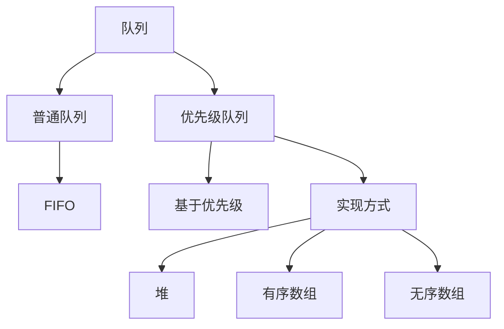
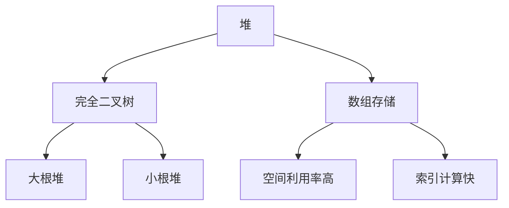
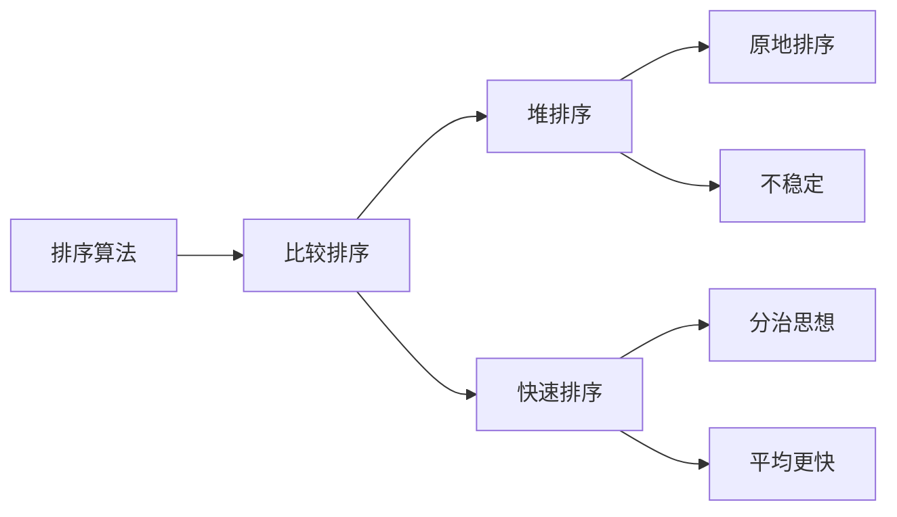
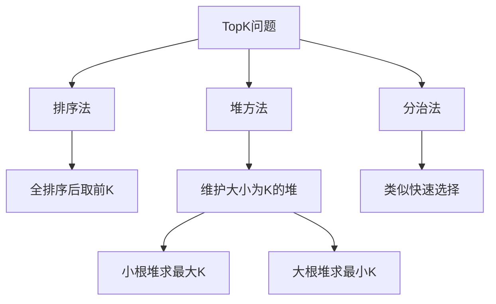
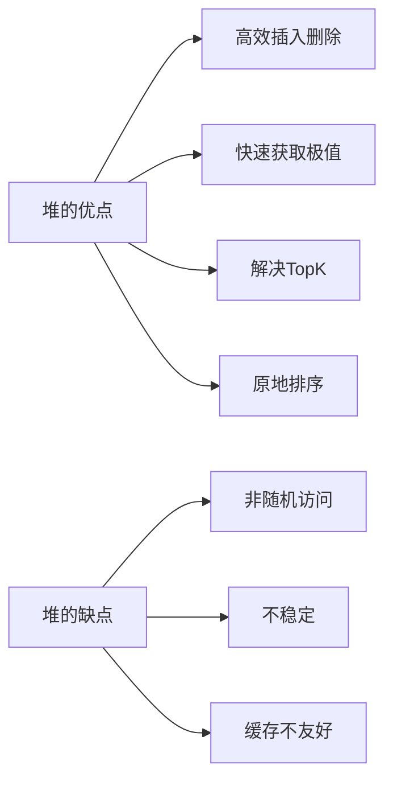

> **[<font face="STCAIYUN" size =  5 color = #386b44ff>数</font><font face="STCAIYUN" size =  5 color = #386b44ff>据</font><font face="STCAIYUN" size =  5 color = #386b44ff>结</font><font face="STCAIYUN" size =  5 color = #386b44ff>构</font><font face="STCAIYUN" size =  5 color = #386b44ff>专</font><font face="STCAIYUN" size =  5 color = #386b44ff>栏 </font>⬅(click)](https://blog.csdn.net/weixin_46491509/category_12935100.html?spm=1001.2014.3001.5482)**
---

今天就让我们来聊聊这个让无数程序员又爱又恨的数据结构——堆（Heap）。

## 一、优先级队列 vs 普通队列

| 特性        | 普通队列          | 优先级队列              |
|-----------|---------------|-------------------|
| 出队顺序     | FIFO（先进先出）    | 按优先级高低（默认小的先出）    |
| 底层实现     | 数组/链表         | 通常用堆实现            |
| 时间复杂度   | O(1)          | 插入O(logN)，删除O(logN) |
| Java实现    | Queue接口       | PriorityQueue类     |
| 典型应用场景 | 消息队列、BFS算法   | 任务调度、TopK问题       |



## 二、堆：一棵"偏心的"完全二叉树

### 堆的类型对比

| 类型     | 特点                  | 应用场景           |
|--------|---------------------|----------------|
| 大根堆   | 父节点 ≥ 子节点           | 堆排序（升序）、TopK最小 |
| 小根堆   | 父节点 ≤ 子节点           | 堆排序（降序）、TopK最大 |
| 二叉堆   | 完全二叉树实现，常用数组存储      | 最常用实现          |
| 斐波那契堆 | 更优的理论时间复杂度，但实现复杂    | 图算法优化         |

```java
// 堆的数组表示
parent(i) = (i-1)/2  // 找父节点
left(i) = 2*i + 1    // 左孩子
right(i) = 2*i + 2    // 右孩子
```



## 三、堆的核心操作：上下调整

### 操作复杂度对比

| 操作        | 时间复杂度 | 空间复杂度 | 说明                 |
|-----------|--------|--------|--------------------|
| 插入(offer) | O(logN) | O(1)   | 需要向上调整(shiftUp)    |
| 删除(poll)  | O(logN) | O(1)   | 需要向下调整(shiftDown)  |
| 查看(peek)  | O(1)   | O(1)   | 直接返回堆顶元素          |
| 建堆       | O(N)   | O(1)   | 自底向上调整比逐个插入更高效    |

```java
// 向下调整示例（小根堆）
void shiftDown(int[] arr, int parent, int len) {
    int child = 2*parent + 1;
    while (child < len) {
        // 找出较小的孩子
        if (child+1 < len && arr[child+1] < arr[child]) child++;
        // 如果父节点已经比孩子小，调整结束
        if (arr[parent] <= arr[child]) break;
        swap(arr, parent, child);  // 交换父子
        parent = child;            // 继续向下调整
        child = 2*parent + 1;
    }
}
```

## 四、堆排序 vs 快速排序

| 特性         | 堆排序           | 快速排序          |
|------------|---------------|---------------|
| 时间复杂度    | O(NlogN)      | O(NlogN)平均    |
| 空间复杂度    | O(1)          | O(logN)递归栈    |
| 稳定性       | 不稳定           | 不稳定           |
| 最坏情况      | O(NlogN)      | O(N²)          |
| 数据访问模式   | 跳跃访问（缓存不友好） | 顺序访问（缓存友好）   |
| 适用场景      | 大数据量          | 中小数据量         |



## 五、PriorityQueue使用指南

### 构造方法对比

| 构造方法                          | 说明                          |
|-------------------------------|-----------------------------|
| new PriorityQueue<>()          | 默认容量11，自然排序                |
| new PriorityQueue<>(int capacity) | 指定初始容量                    |
| new PriorityQueue<>(Comparator) | 自定义比较器（可实现大根堆）            |
| new PriorityQueue<>(Collection) | 用已有集合初始化（自动建堆）            |

```java
// 大根堆实现
PriorityQueue<Integer> maxHeap = new PriorityQueue<>((a,b) -> b-a);

// 自定义对象排序
PriorityQueue<Student> pq = new PriorityQueue<>(
    (s1, s2) -> s1.score != s2.score ? 
        s2.score - s1.score :  // 分数高的在前
        s1.name.compareTo(s2.name)  // 分数相同按名字
);
```

## 六、TopK问题的三种解法对比

| 方法          | 时间复杂度   | 空间复杂度 | 适用场景           |
|-------------|----------|--------|----------------|
| 快速排序+取前K  | O(NlogN) | O(logN) | 数据可全部装入内存      |
| 堆排序        | O(NlogK) | O(K)   | 海量数据，K较小       |
| 冒泡K次       | O(N*K)   | O(1)   | K非常小（如K=1,2）   |



## 七、堆的常见面试题

### 1. 堆的建立过程（以小根堆为例）

```java
//向下调整方法(复杂度logN)
    public static void shiftDown(int[] array, int index){
        //要调整的父节点
        int parent = index;
        //要调整的孩子节点
        int child = 2*parent + 1;
        while (child < array.length){
            //child+1其实代表的是右子树
            //判断左右子树大小
            if(child+1<array.length && array[child+1] < array[child]){
                //左右子树对调
                child = child+1;
            }
            //判断左子树和父节点的大小
            if (array[child] >= array[parent]){
                break;
            }
            else{
                int temp = array[parent];
                array[parent] = array[child];
                array[child] = temp;
                //更新父节点和子节点的指向
                parent = child;
                child = 2*parent +1;
            }
        }
    }

    /**
     *建堆操作复杂度O(n)
     * @param array
     */
    public static void createHeap(int[] array){
        //要先找到最后一个非叶子节点
        int lastLeaf  = array.length-1;
        int lastParent = (lastLeaf-1)/2;
        for (int i = lastParent; i >= 0; i--){
            shiftDown(array, i);
        }
    }
```

### 2. 堆的应用场景总结

| 应用场景            | 使用的堆类型      | 原因说明               |
|-----------------|-------------|--------------------|
| 堆排序            | 大根堆/小根堆    | 升序用大根堆，降序用小根堆     |
| TopK最大元素       | 小根堆        | 维护K个元素的小根堆，淘汰小的   |
| TopK最小元素       | 大根堆        | 维护K个元素的大根堆，淘汰大的   |
| 任务调度（优先级高的先执行） | 大根堆        | 优先级高的在堆顶          |
| 合并K个有序链表       | 小根堆        | 每次取最小节点，效率O(logK) |
| Dijkstra算法     | 小根堆        | 每次取距离最小的节点        |

## 八、总结：堆的"堆"德

### 堆的优缺点分析

**优点：**
1. 插入/删除时间复杂度稳定在O(logN)
2. 获取极值（堆顶）只需O(1)
3. 可以高效解决TopK问题
4. 堆排序是原地排序，空间复杂度O(1)

**缺点：**
1. 访问非堆顶元素效率低（需要遍历）
2. 不是稳定排序（相同元素可能换位）
3. 缓存不友好（数组跳跃访问）



## 九、终极对比表：堆 vs 其他数据结构

| 特性         | 堆            | 二叉搜索树       | 跳表           | 哈希表          |
|------------|--------------|--------------|--------------|--------------|
| 查找极值      | O(1)        | O(logN)      | O(logN)      | O(N)         |
| 插入/删除     | O(logN)     | O(logN)      | O(logN)      | O(1)平均      |
| 有序性       | 部分有序（仅堆顶） | 完全有序        | 完全有序        | 无序          |
| 空间复杂度    | O(N)        | O(N)         | O(N)         | O(N)         |
| 实现难度      | 中等          | 中等           | 困难           | 中等          |
| 典型应用      | 优先级队列、TopK | 范围查询、有序数据  | 高性能有序数据结构 | 快速查找、去重    |

---

**最后的小幽默**：

程序员的世界里：
- 当你学会堆：哇！我"堆"数据结构理解好深！
- 当你写堆代码：这bug怎么"堆"了这么多！
- 当你面试被问堆：面试官，咱们能"堆"心一点吗？