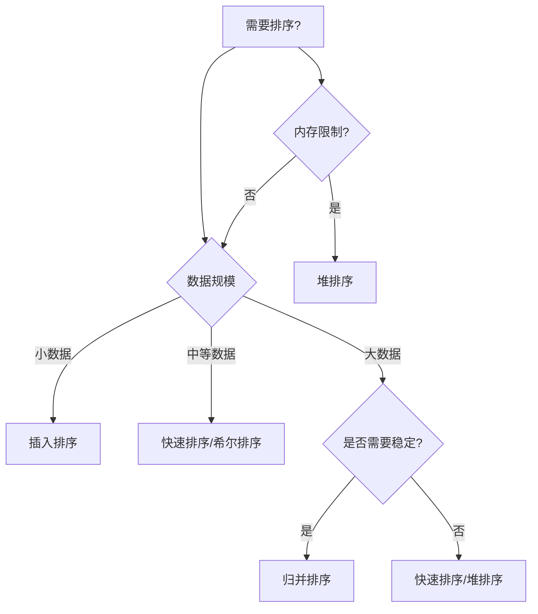

> **[<font face="STCAIYUN" size =  5 color = #386b44ff>数</font><font face="STCAIYUN" size =  5 color = #386b44ff>据</font><font face="STCAIYUN" size =  5 color = #386b44ff>结</font><font face="STCAIYUN" size =  5 color = #386b44ff>构</font><font face="STCAIYUN" size =  5 color = #386b44ff>专</font><font face="STCAIYUN" size =  5 color = #386b44ff>栏 </font>⬅(click)](https://blog.csdn.net/weixin_46491509/category_12935100.html?spm=1001.2014.3001.5482)**
---

## 开篇：当数据开始"排队"

想象你是一位扑克牌魔术师（没错，就是那种能把一副乱序的牌瞬间理整齐的酷炫角色）。今天，我要揭秘的正是计算机世界中最神奇的"整理魔法"——排序算法！准备好你的魔杖（键盘），我们开始这场奇幻之旅吧！

## 第一章：基础魔法——排序概念入门

### 1.1 什么是排序？
> "把大象装冰箱需要三步，把数据排好序也只需要三步：比较、移动、重复" —— 某不愿透露姓名的算法魔法师

**稳定性魔咒**：
- 稳定魔法：5₁和5₂这两个相同数字，排序后保持原始顺序
- 不稳定魔法：5₁和5₂可能交换位置

### 1.2 内存中的魔法 vs 磁盘上的魔法
- **内部排序**：所有数据都在内存中（像在桌子上整理扑克牌）
- **外部排序**：数据太大要借助磁盘（像整理一个图书馆的书籍）

## 第二章：七大排序魔法详解


### 2.1 插入排序——扑克牌大师的秘技

> 思路：整个数组划分为有序区间和无序区间，每次取出无序区间一个元素，插入到有序区间的合适位置
整个过程循环n-1次,时间复杂度O(n²)，空间复杂度O(1)
```java
    private static void insertSort(int[] arr){
        // bond是有序和无序的边界
        for(int bond = 1; bond < arr.length; bond++){
            int value = arr[bond];
            int cur = bond-1;
            for (;cur>=0;cur--){
                if(arr[cur]>value){
                    //这种情况就需要搬运，把cur位置的元素搬运到cur+1的位置
                    arr[cur+1] = arr[cur];
                }else {
                    //此时说明已经到达合适位置，退出循环直接插入即可
                    break;
                }
            }
            //意味着将value应该放在cur之后，也就是cur+1的位置
            arr[cur+1] = value;
        }
    }
```


> - 最佳情况：O(n)（当牌已经基本有序时）
> - 最差情况：O(n²)（当牌完全逆序时）
> - 稳定性：✔️（相同点数的牌保持顺序）

### 2.2 希尔排序——分组跳跃的魔法（插入排序的plus）


> - 思路：先把整个数组分成若干组，针对每个数组分别进行插入排序
希尔排序,分组插排操作,不是只进行一次,而是要进行若干次的~~
比如 指定 gap 为 3 2 1 这样的序列
先按照 gap 为 3 进行分组插排
再按照 gap 为 2 进行分组插排
最后按照 gap 为1进行分组插排 (就相当于普通的插入排序) =>肯定能保证有序的
> - 普通的插入排序:
1.如果要排序的数组,很短,整体的效率就很高.
2.如果要排序的数组,已经基本有序,整体效率也很高
当 gap 的值比较大的时候,分出的组就多，每个组的元素就少.针对每个组分别插排,都很快
当 gap 的值比较小的时候,分的组是少了,通过前面的准备工作,已经使整个数组相对来说比较有序了.这个时候意味着此时的速度也很快~~
> - 时间复杂度最坏为O(n²)，平均复杂的根据gap值来确定，gap一般取值size/2，size/2，size/4 ……空间复杂度为O(1)
```java
    private static void shellSort(int[] arr){
        int gap = arr.length/2;
        while(gap>=1){
            //针对每个组进行插入排序
            insertSortGap(arr, gap);
            //添加一个打印，看每次gap的效果
            System.out.println("gap = " + gap + " : " + Arrays.toString(arr));
            gap /= 2;
        }
    }

    private static void insertSortGap(int[] arr, int gap){
        // 分组插入排序
        // 每个组中的元素，下标差值为gap
        // 例如，gap为3的时候，组为[0，3)，[3，6)，[6，9)
        // 此处同一个组内部的元素下标差值是gap。取下一个元素看起来是bound += gap
        // 但是此处的处埋，其实是针对所有的组，同时处理
        // 比如gap为3，则有3个组，比如是0，1，2
        // bound 的循坏过程，就是在处理第 0 组的第1个元素的插入，再处理第1组的第1个元素的插入，再处理第2组的第1个元素的插入
        // 然后再处理第0组的第2个元素的插入，再处理第1组的第2个元素的插入，再处理第2组的第2个元素的插入.以此类推
        for (int bond = gap; bond < arr.length; bond++){
            int value = arr[bond];
            int cur = bond - gap;
            for (;cur>=0;cur-=gap){
                if(arr[cur]>value){
                    arr[cur + gap] = arr[cur];
                }else{
                    break;
                }
            }
            arr[cur + gap] = value;

        }
    }
```

> **未解之谜**：希尔排序的时间复杂度至今仍是算法界的"魔法谜题"，不同魔法师给出了不同的答案：
> - O(n^1.25) ~ O(1.6n^1.25)（Knuth的猜想）
> - O(n^1.3)（实验统计结果）
> - O(n log²n)（某些特定间隔序列）
> - 稳定性：❌

### 2.3 直接选择排序——打擂主的挑战赛
>  - 思路： 把整个数组划分成两个区间,前半部分已排序区间(==有序区间==),后半部分是待排序区间(==无序区间==)初始情况下,有序区间是空区间
> - 从无序区间中,找出整个无序区间里的最小值,把这个最小值,和无序区间的第一个元素交换同时把这个无序区间的第一个元素,划分到有序区间中每次进行一趟,都会使有序区间变大一点~~
> - 这个找最小的过程，通过"打擂主”的方式，以待排序区间的第一个元素位置作为“擂主”
> - 拿着后续的每个元素都和擂台上的元素进行比较。如果比擂台元素小，就交换.


```java
    private  static void selectSort(int[] arr){
        // [0, bond)已排序区间 [bond,arr.length)未排序区间
        for(int bond = 0;bond<arr.length-1;bond++){
            for(int cur = bond+1;cur<arr.length;cur++){
                if(arr[bond]>arr[cur]){
                    //打擂成功，进行交换
                    int temp = arr[bond];
                    arr[bond] = arr[cur];
                    arr[cur] = temp;
                }
            }
            //打印执行效果
            System.out.println("bond = " + bond + " : " + Arrays.toString(arr));
        }
    }
```
> - 时间复杂度O(n²) 
> - 空间复杂度O(1) 
> - 不稳定排序


### 2.4 堆排序——懂得利用工具的算法
>-  **堆排序的基本思想**:
     1.针对整个数组,建立大堆.(初始情况下,整个数组,都是"待排序区间")
     2.把堆顶元素和待排序区间的最后一个元素,交换.(把最大元素就放到已排序区间中了)
     3.把堆顶元素进行向下调整,确保前面堆的结构仍然合法的,


 

```java
public static void heapSort(int[] arr){
        creatHeap(arr);
        int bond = arr.length - 1;
        for (int i = 0;i<arr.length;i++){
            int temp = arr[0];
            arr[0] = arr[bond];
            arr[bond] = temp;
            shiftDown(arr, bond, 0);
            bond--;   //将最后一个元素添加到已排序部分
        }

    }
    //建大堆
    public static void creatHeap(int[] arr){
        int lastLeaf = arr.length - 1;
        for (int i = lastLeaf-1;i>=0;i--){
            shiftDown(arr, arr.length, i);
        }
    }
    //向下调整
    public static void shiftDown(int[] arr, int len, int index){
        int parent = index;
        int child = 2 * parent + 1;
        while (child < len){
            if(child + 1 < len && arr[child] < arr[child+1]){
                child += 1;
            }
            if(arr[child] > arr[parent]){
                int temp = arr[parent];
                arr[parent] = arr[child];
                arr[child] = temp;
            }else {
                break;
            }
            parent = child;
            child = 2 * parent + 1;
        }
    }
```
> - 时间复杂度O(NlogN) 
> - 空间复杂度O(1) 
> - 不稳定排序
### 2.5 冒泡排序——沉浮的法则
>-    冒泡排序比较交换相邻元素，这样的一趟下来就能把最大值放到最后.(或者从后往前遍历,此时就能把最小值放到最前)


```java
public static void bubbleSort(int[] arr){
        for (int bond = 0; bond < arr.length - 1; bond++) {
            for(int cur = arr.length - 1;cur > bond;cur--){
                if(arr[cur - 1] > arr[cur]){
                    int temp = arr[cur - 1];
                    arr[cur - 1] = arr[cur];
                    arr[cur] = temp;
                }
            }
            System.out.println(Arrays.toString(arr));
        }
    }
```
> - 时间复杂度O(N²) 
> - 空间复杂度O(1) 
> -  稳定排序

### 2.6 快速排序（Hoare版本）——分而治之的闪电魔法
>- 寻找基准值方法
>- 针对left，right 闭区间，进行整理,
>- 注意选择基准值的位置，和后续两个下标运动的先后顺是有关的：
>   1. 如果选择最==右侧元素==为基准值，就需要先从左往右找比基准值大的，后从右往左找比基准值小的
>   2. 如果选择最==左侧元素==为基准值，就需要先从右往左找比基准值小的，后从左往右找比基准值大的.


快速排序（递归版）
```java
// 方法入口
    //此处约定[left，right]闭区间为待处理区间
    public static void quickSort(int[] arr){
        quickSort(arr, 0, arr.length-1);
    }

    //辅助递归工具
    public static void quickSort(int[] arr, int left, int right){

        //结束递归条件（当前区间为空区间或者只有一个元素）
        if(left>=right){
            return;
        }
        int index = partition(arr, left, right);
        //对基准值左边进行递归
        quickSort(arr, left, index-1);
        //对基准值右边进行递归
        quickSort(arr, index+1, right);
    }
    //寻找基准值方法
    private static int partition(int[] arr, int left, int right){
    	// 选取最右边元素为基准值
        int pivot = arr[right];
        int l = left;
        int r = right;
        while (l < r){
            while (l<r && arr[l]<=pivot){
                l++;
            }
            while (l<r && arr[r]>=pivot){
                r--;
            }
            swap(arr, l, r);
        }
        //最外层循环结束后要交换重合值和基准值
        swap(arr, l, right);
        return l;
    }
    //交换方法
    private static void swap(int[] arr, int left, int right){
        int temp = arr[left];
        arr[left] = arr[right];
        arr[right] = temp;
    }
}
```
快速排序(循环版)
```java
    // 快速排序(非递归版本)
    static class Range{
        private int left;
        private int right;
        public Range(int left, int right){
            this.left = left;
            this.right = right;
        }
    }

    public static void quickSortByLoop(int[] arr){
        //利用栈模拟递归过程
        Stack<Range> range = new Stack<>();
        range.push(new Range(0, arr.length - 1));
        while (!range.isEmpty()){
            Range top = range.pop();
            if(top.left >= top.right){
                continue;
            }
            int pivot = Partition(arr, top.left, top.right);
            range.push(new Range(top.left, pivot - 1));
            range.push(new Range(pivot + 1, top.right));
        }
        //当循环结束时，排序就已经完成了
    }
    
	public static int Partition(int[] arr, int left, int right){
        int pivot = arr[left];
        int l = left;
        int r = right;
        while (l<r){
            while (l<r && arr[r]>=pivot){
                r--;
            }
            while (l<r && arr[l]<=pivot){
                l++;
            }
            swap(arr, l, r);
        }
        //记住传参是传基准值的下标而不是直接传基准值
        swap(arr, l, left);
        return l;
    }

    public static void swap(int[] arr, int i, int j){
        int temp = arr[i];
        arr[i] = arr[j];
        arr[j] = temp;
    }
```

>- 基准选择：三数取中法(减少取到极端值的概率)或者选择最右边或者最左边
>- 时间复杂度：最坏O(N²) 平均O(NlogN)
>- 空间复杂度：最坏O(N) 平均O(logN)
>-  不稳定排序

### 2.7 归并排序——耐心的拼图魔法
>- 归并排序的核心流程分为两步：
> 1. **拆分（Divide）**：将数组不断二分，直到每个子数组只包含 1 个元素（天然有序）。
>2. **合并（Merge）**：将两个有序子数组合并为一个更大的有序数组，重复此过程直到合并为完整数组。


```java
 public static void mergeSort(int[] arr){
        mergeSort(arr, 0, arr.length-1);

    }

    //归并排序的辅助方法。参数中引入子区间，通过子区间来进行决定当前是要针对哪个部分的数组进行归并排序
    public static void mergeSort(int[] arr, int left, int right){
        //1.如果子区间只有一个或者没有元素，则不需要递归
        if(left>=right)return;
        //2.把当前区间分为两个等长区间，分别进行递归
        int mid = (left + right)/2;
        //3.递归左半边和递归右半边
        // 快速排序是分成三个部分，基准值是单独一个部分，左右递归时，需要把基准值位置给去除
        // 归并排序是分成两个部分，mid这个位置的元素也要参与递归
        mergeSort(arr, left, mid);
        mergeSort(arr, mid+1, right);
        //4.完成上述递归后说明左右两个区间已经是有序的了，开始合并
        merge(arr, left, mid, right);
    }

    private static void merge(int[] arr, int left, int mid, int right){
        //1.先创建一个临时数组保存结果，临时数组的长度应该是right-left+1
        int[] result = new int[right - left + 1];
        //后续合并时候，要把对应的元素进行尾插到尾插到result中的，使用resultSize表示result中已经插入的元素个数
        //此处就是在模拟简单的顺序表
        int resultSize = 0;
        //2.设定两个下标指向每个区间的开头
        int cur1 = left;
        int cur2 = mid + 1;
        while (cur1 <= mid && cur2 <= right){
            if(arr[cur1] < arr[cur2]){
                // 把cur1位置的元素插到result中
                result[resultSize++] = arr[cur1];
                cur1++;
            }else {
                result[resultSize++] = arr[cur2];
                cur2++;
            }
        }
        //3.处理剩余的元素，由于这两个区间的长度不一定完全相同，只需要把多余的部分，整体尾插到result中即可
        while (cur1<=mid){
            result[resultSize++] = arr[cur1];
            cur1++;
        }
        while (cur2<=right){
            result[resultSize++] = arr[cur2];
            cur2++;
        }
        for (int i = 0; i < resultSize; i++){
            arr[left+i] = result[i];
        }

    }
```
>- 时间复杂度：O(NlogN)
>- 空间复杂度：O(N) 
>-  稳定排序
## 第三章：性能比较

### 3.1 七大排序性能表

| 排序魔法 | 平均时间复杂度 | 最坏情况 | 空间复杂度 | 稳定性 | 适用场景 |
|---------|--------------|---------|-----------|--------|----------|
| 冒泡排序 | O(n²) | O(n²) | O(1) | ✔️ | 教学演示 |
| 选择排序 | O(n²) | O(n²) | O(1) | ❌ | 交换成本高时 |
| 插入排序 | O(n²) | O(n²) | O(1) | ✔️ | 小数据/基本有序 |
| 希尔排序 | O(n log n) | O(n²) | O(1) | ❌ | 中等规模数据 |
| 归并排序 | O(n log n) | O(n log n) | O(n) | ✔️ | 大数据/需要稳定 |
| 快速排序 | O(n log n) | O(n²) | O(log n) | ❌ | 通用场景 |
| 堆排序 | O(n log n) | O(n log n) | O(1) | ❌ | 内存受限时 |

### 3.2 算法选择指南（思维导图版）




## 第四章：现实中的魔法应用

### 4.1 百亿数据排序——外部排序的魔法

当你的数据比内存还大时（比如100G数据，只有1G内存）：

1. **分割阶段**：将大文件切成200份512M的小文件（就像把一座山分成可搬运的石头）
2. **排序阶段**：分别对每个小文件排序（在内存中整理每块石头）
3. **归并阶段**：使用2路归并逐步合并（把整理好的石头重新组装成山）

```java
// 伪代码：外部排序的魔法仪式
public void externalSort(File bigFile) {
    List<File> chunks = splitIntoChunks(bigFile, 512MB); // 第一步：分割
    for (File chunk : chunks) {
        sortInMemory(chunk); // 第二步：内存排序
    }
    mergeSortedChunks(chunks); // 第三步：归并
}
```
---

现在，你已经成为了一名合格的"排序魔法师"！下次当你看到杂乱的数据时，记得选择合适的"魔法"来驯服它们。记住，没有最好的魔法，只有最适合的魔法！✨