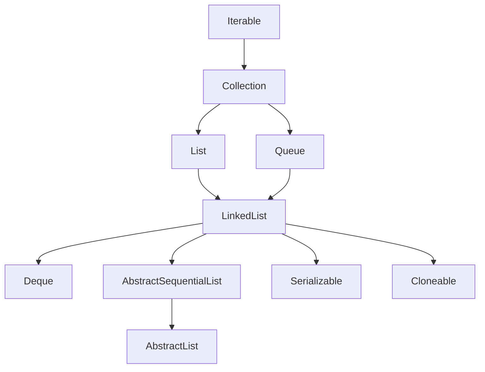

> **[<font face="STCAIYUN" size =  5 color = #386b44ff>数</font><font face="STCAIYUN" size =  5 color = #386b44ff>据</font><font face="STCAIYUN" size =  5 color = #386b44ff>结</font><font face="STCAIYUN" size =  5 color = #386b44ff>构</font><font face="STCAIYUN" size =  5 color = #386b44ff>专</font><font face="STCAIYUN" size =  5 color = #386b44ff>栏 </font>⬅(click)](http://localhost:4321/archive/?category=Java%E6%95%B0%E6%8D%AE%E7%BB%93%E6%9E%84)**

## 🌟 引言
在Java集合框架中，`LinkedList`和`ArrayList`是最常用的两种列表结构。它们各有优劣，适用于不同的场景。本文将带你深入探索`LinkedList`的底层实现——链表，并通过丰富的代码示例和对比分析，帮助你全面掌握其特性和应用场景。


---

## 📚 1. ArrayList的缺陷
`ArrayList`底层基于**动态数组**实现，虽然支持高效的随机访问（时间复杂度为==O(1)==），但在任意位置插入或删除元素时，需要搬移后续元素，导致时间复杂度为==O(n)==。例如：
```java
ArrayList<Integer> list = new ArrayList<>();
list.add(1); // 添加到末尾，O(1)
list.add(0, 0); // 插入到头部，O(n)
```
**缺陷总结**：
- 插入/删除效率低（尤其是头部或中间位置）。
- 扩容时需要拷贝数据，额外开销大。

---

## 🔗 2. 链表：LinkedList的底层结构W
### 2.1 链表的概念
链表是一种**物理存储非连续**的数据结构，通过节点的引用（指针）实现逻辑上的连续性。  

**特点**：
- 节点包含数据域和指针域。
- 物理上不连续，逻辑上连续。

### 2.2 链表的分类
链表有多种结构组合，常见的两种：
1. **无头单向非循环链表**：结构简单，常用于**面试题**。

2. **无头双向循环链表**：Java中`LinkedList`的底层实现。


**双向链表节点定义**：
```java
class Node {
    int val;
    Node prev;
    Node next;
}
```

---

## ⚙️ 3. LinkedList的模拟实现
以下是一个简化版的无头单链表实现：

```java

/*关于LinkedList的实现练习，只实现String属性*/


//通过这个类来表示一个链表的单链表节点，如果是双链表还需要一个prev
class Node{
    //节点保存的值,为了练习方便把属性设置为public
    public String value;
    //节点的下一个元素
    public Node next;

    //创建构造方法进行初始化
    public Node(String value){
        this.value = value;
        this.next = null;
    }

}

public class MyLinkedList {

    //表示链表的头节点
    //由于此处不考虑傀儡节点，所以当head为空时，表示为一个空链表
    private Node head = null;
    //不像顺序表搞一个size表示有效元素的区间

    //尾插
    public void addLast(String value){
        //如果head为null，直接让它指向新节点
        if(head == null){
            Node newNode = new Node(value);
            head = newNode;
            return;

        }
        //思路：先找到尾巴
        //先把尾巴指向head节点，一直遍历往下找
        Node tail = head;

        for (; tail != null; tail = tail.next){
            if(tail.next == null){
                break;
            }
        }
        //通过上述循环，循环结束之后，此时的tail指向尾巴了
        //此时就创建新的节点，让尾节点的next指向newNode
        Node newNode = new Node(value);
        tail.next = newNode;
        //再把newNode的节点指向null，由于在构造方法中中已经做了这件事，不写也没关系
        newNode.next = null;
    }

    //头插
    public void addFirst(String value){
        //根据刚才value的值，创建一个节点
        Node newNode = new Node(value);
        //把新的节点放到头位置做两件事：
        //1.把新节点的next指向原来的头节点
        newNode.next = head;
        //2.让head指向新节点
        head = newNode;

    }

    //指定位置插入
    public void add(int index, String value){

    }

    //重写toString通过这个方法去遍历链表，构成一个字符串，方便打印
    @Override
    public String toString() {
        //遍历的时候，需要从头结点开始，进行一个元素一个元素的打印
        StringBuilder str = new StringBuilder();
        str.append("[");

        for (Node current = head;current != null;current = current.next){
            if(current.next != null){
                str.append(current.value);
                str.append(",");
            }else {
                str.append(current.value);
            }
        }
        str.append("]");
        return str.toString();
    }

    //----------------------------------------------------------

    public static void test1(MyLinkedList list){
        list.addFirst("A");
        list.addFirst("B");
        list.addFirst("C");
        System.out.println(list);
    }

    public static void test2(MyLinkedList list){
        list.addLast("A");
        list.addLast("B");
        list.addLast("C");
        list.addLast("D");
        list.addLast("E");
        System.out.println(list);
    }

    public static void main(String[] args) {
        MyLinkedList list = new MyLinkedList();
        test1(list);
        MyLinkedList list2 = new MyLinkedList();
        test2(list2);
    }
}

```

以下是一个简化版的双向链表实现：
```java
public class MyLinkedList {
    private Node head;
    private Node tail;
    private int size;

    // 头插法
    public void addFirst(int data) {
        Node newNode = new Node(data);
        if (head == null) {
            head = tail = newNode;
        } else {
            newNode.next = head;
            head.prev = newNode;
            head = newNode;
        }
        size++;
    }

    // 删除指定值的节点
    public void remove(int key) {
        Node cur = head;
        while (cur != null) {
            if (cur.val == key) {
                if (cur == head) {
                    head = head.next;
                    if (head != null) head.prev = null;
                } else {
                    cur.prev.next = cur.next;
                    if (cur.next != null) cur.next.prev = cur.prev;
                }
                size--;
                return;
            }
            cur = cur.next;
        }
    }
}
```

---

## 🛠️ 4. LinkedList的使用
### 4.1 Java集合框架部分：LinkedList继承体系（思维导图）


### 4.2 常用方法


### 4.3 遍历方式
```java
// 1. for-each循环
for (int num : list) {
    System.out.print(num + " ");
}

// 2. 迭代器
Iterator<Integer> it = list.iterator();
while (it.hasNext()) {
    System.out.print(it.next() + " ");
}

// 3. 反向迭代器
Iterator<Integer> rit = list.descendingIterator();
while (rit.hasNext()) {
    System.out.print(rit.next() + " ");
}
```

---

## 🧩 5. 经典链表OJ题解析
### 5.1 反转链表
**题目**：反转一个单链表。  
**代码**：
```java
public ListNode reverseList(ListNode head) {
    ListNode prev = null;
    ListNode cur = head;
    while (cur != null) {
        ListNode next = cur.next;
        cur.next = prev;
        prev = cur;
        cur = next;
    }
    return prev;
}
```

### 5.2 判断链表是否有环
**快慢指针法**：
```java
public boolean hasCycle(ListNode head) {
    ListNode slow = head, fast = head;
    while (fast != null && fast.next != null) {
        slow = slow.next;
        fast = fast.next.next;
        if (slow == fast) return true;
    }
    return false;
}
```

---

## 📊 6. ArrayList vs LinkedList
| **对比维度**       | **ArrayList**          | **LinkedList**         |
|--------------------|------------------------|------------------------|
| **底层结构**       | 动态数组               | 双向链表               |
| **随机访问**       | O(1)                   | O(n)                   |
| **头插/删效率**    | O(n)                   | O(1)                   |
| **内存占用**       | 连续空间，可能浪费     | 分散存储，无浪费       |
| **适用场景**       | 频繁访问+少量修改      | 频繁插入/删除          |

**选择建议**：
- 需要快速随机访问？选`ArrayList`！
- 频繁在头部或中间插入/删除？选`LinkedList`！
## 💡 7.记忆技巧

```bash
Iterable是根源，
Collection分三派(List/Queue/Set)，
List有三各不同：
数组实现ArrayList，
链表实现LinkedList，
线程安全Vector顶。

标记接口要记清：
Serializable可序列，
Cloneable能复制，
RandomAccess随机快。
```

---

## 🎯 总结
- **链表**通过节点引用实现逻辑连续，适合频繁修改的场景。
- **LinkedList**在Java中基于双向链表实现，提供了高效的插入/删除操作。
- 理解链表的核心在于掌握指针操作和边界条件处理。

通过本文的学习，相信你对链表和`LinkedList`有了更深入的理解！快去LeetCode上挑战更多链表题目吧！  

**💬 互动话题**：你在项目中用过`LinkedList`吗？遇到过哪些坑？欢迎评论区分享！  