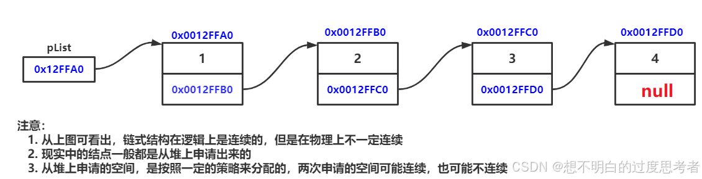
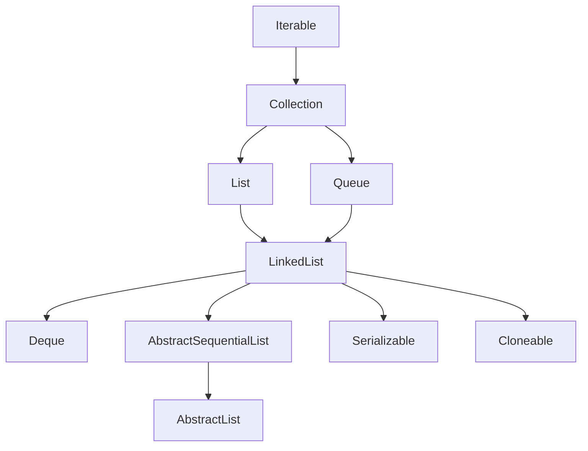

> **[<font face="STCAIYUN" size =  5 color = #386b44ff>数</font><font face="STCAIYUN" size =  5 color = #386b44ff>据</font><font face="STCAIYUN" size =  5 color = #386b44ff>结</font><font face="STCAIYUN" size =  5 color = #386b44ff>构</font><font face="STCAIYUN" size =  5 color = #386b44ff>专</font><font face="STCAIYUN" size =  5 color = #386b44ff>栏 </font>⬅(click)](https://blog.csdn.net/weixin_46491509/category_12935100.html?spm=1001.2014.3001.5482)**

## 🌟 引言
在Java集合框架中，`LinkedList`和`ArrayList`是最常用的两种列表结构。它们各有优劣，适用于不同的场景。本文将带你深入探索`LinkedList`的底层实现——链表，并通过丰富的代码示例和对比分析，帮助你全面掌握其特性和应用场景。


---

## 📚 1. ArrayList的缺陷
`ArrayList`底层基于**动态数组**实现，虽然支持高效的随机访问（时间复杂度为==O(1)==），但在任意位置插入或删除元素时，需要搬移后续元素，导致时间复杂度为==O(n)==。例如：
```java
ArrayList<Integer> list = new ArrayList<>();
list.add(1); // 添加到末尾，O(1)
list.add(0, 0); // 插入到头部，O(n)
```
**缺陷总结**：
- 插入/删除效率低（尤其是头部或中间位置）。
- 扩容时需要拷贝数据，额外开销大。

---

## 🔗 2. 链表：LinkedList的底层结构W
### 2.1 链表的概念
链表是一种**物理存储非连续**的数据结构，通过节点的引用（指针）实现逻辑上的连续性。  

**特点**：
- 节点包含数据域和指针域。
- 物理上不连续，逻辑上连续。

### 2.2 链表的分类
链表有多种结构组合，常见的两种：
1. **无头单向非循环链表**：结构简单，常用于**面试题**。

2. **无头双向循环链表**：Java中`LinkedList`的底层实现。


**双向链表节点定义**：
```java
class Node {
    int val;
    Node prev;
    Node next;
}
```

---

## ⚙️ 3. LinkedList的模拟实现
以下是一个简化版的无头单链表实现：

```java

/*关于LinkedList的实现练习，只实现String属性*/

//通过这个类来表示一个链表的单链表节点，如果是双链表还需要一个prev
/*关于LinkedList的实现练习，只实现String属性*/


//通过这个类来表示一个链表的单链表节点，如果是双链表还需要一个prev
class Node{
    //节点保存的值,为了练习方便把属性设置为public
    public String value;
    //节点的下一个元素
    public Node next;

    //创建构造方法进行初始化
    public Node(String value){
        this.value = value;
        this.next = null;
    }

}

public class MyLinkedList {

    //表示链表的头节点
    //由于此处不考虑傀儡节点，所以当head为空时，表示为一个空链表
    private Node head = null;
    //不像顺序表搞一个size表示有效元素的区间

    //尾插
    public void addLast(String value){
        //如果head为null，直接让它指向新节点
        if(head == null){
            Node newNode = new Node(value);
            head = newNode;
            return;

        }
        //思路：先找到尾巴
        //先把尾巴指向head节点，一直遍历往下找
        Node tail = head;

        for (; tail != null; tail = tail.next){
            if(tail.next == null){
                break;
            }
        }
        //通过上述循环，循环结束之后，此时的tail指向尾巴了
        //此时就创建新的节点，让尾节点的next指向newNode
        Node newNode = new Node(value);
        tail.next = newNode;
        //再把newNode的节点指向null，由于在构造方法中中已经做了这件事，不写也没关系
        newNode.next = null;
    }

    //头插
    public void addFirst(String value){
        //根据刚才value的值，创建一个节点
        Node newNode = new Node(value);
        //把新的节点放到头位置做两件事：
        //1.把新节点的next指向原来的头节点
        newNode.next = head;
        //2.让head指向新节点
        head = newNode;

    }

    //指定位置插入
    public void add(int index, String value){

        //1.先进行合法性检查
        if(index < 0 || index > size()){
            //index == size时相当于尾插，属于合法情况
            throw new RuntimeException("Index out of bounds");
        }

        //2.针对头插特殊处理
        if(index == 0){
            addFirst(value);
            return;
        }

        //3.根据当前value值，去新建一个节点
        Node newNode = new Node(value);

        //4.找到index要插入的位置的上一个节点
        // 由于当前的链表是单向链表，每个节点，只能找到next
        // 插入新节点需要修改前一个节点的next值
        // 前一个节点的下标应该是index-1
        Node prev = head;
        for (int i = 0; i < index-1; i++) {
            prev = prev.next;
        }

        //5.通过上述循环，就让prev指向index-1的位置
        newNode.next = prev.next;
        prev.next = newNode;

    }

    //虽然没有size但是我们可以现成写一个size()
    //但是这样的过程时间复杂度为O(N)
    public int size(){
        int size = 0;

        for (Node current = head;current != null; current = current.next){
            size++;
        }
        return size;
    }

    //实现判定某个元素是否在链表中包含
    public Boolean contains(String value){
        for (Node current = head; current != null; current = current.next){
            if(current.value.equals(value)){
                return true;
            }
        }
        return false;
    }

    //实现搜寻某个元素的下标
    public int indexOf(String value){
        int index = 0;
        for(Node current = head; current != null; current = current.next){
            if(current.value.equals(value)){
                return index;
            }
            index++;
        }
        return -1;
    }

    //实现删除链表中的某个元素操作（指定下标）
    public void remove(int index){
        if(index < 0 || index >= size()){
            throw new RuntimeException("Index out of bounds");
        }

//        //自己实现的想法
//        //判断下标为0
//        if(index == 0){
//            head = head.next;
//        }
//        int lastIndex = 0;
//        for (Node prev = head; prev != null; prev = prev.next){
//            Node toRemove = prev.next;
//            if( lastIndex == index-1){
//                prev.next =toRemove.next;
//            }
//            lastIndex++;
//        }

        //其他实现做法
        //1.这对特殊情况处理
        if(index == 0){
            head = head.next;
            return;
        }
        //2.找到被删除元素的前一个节点
        Node prev = head;
        for (int i = 0; i < index-1; i++) {
            prev = prev.next;
        }
        //3.循环结束，prev就指向待删除元素的上一个节点
        Node toRemove = prev.next;
        //4.进行删除操作
        prev.next = toRemove.next;

    }
    //实现删除链表中的某个元素操作（指定值）
    public void remove(String value){
        //1.先找到元素所在下标
        int index = indexOf(value);
        if(index == -1){
            System.out.println("所删除元素不存在");
            return;
        }
        remove(index);

    }

    //实现清空链表所有元素
    public void clear(){
        //直接修改head，head指向原来的Node对象都没有引用指向了，都会被gc回收
        head = null;
    }


    //重写toString通过这个方法去遍历链表，构成一个字符串，方便打印
    @Override
    public String toString() {
        //遍历的时候，需要从头结点开始，进行一个元素一个元素的打印
        StringBuilder str = new StringBuilder();
        str.append("[");

        for (Node current = head;current != null;current = current.next){
            if(current.next != null){
                str.append(current.value);
                str.append(",");
            }else {
                str.append(current.value);
            }
        }
        str.append("]");
        return str.toString();
    }

    //----------------------------------------------------------

    //头插测试
    public static void test1(MyLinkedList list){
        list.addFirst("A");
        list.addFirst("B");
        list.addFirst("C");
        System.out.println(list);
    }

    //尾插测试
    public static void test2(MyLinkedList list){
        list.addLast("A");
        list.addLast("B");
        list.addLast("C");
        list.addLast("D");
        list.addLast("E");
        System.out.println(list);
    }

    //指定位置插入测试
    public static void test3(MyLinkedList list){

        list.add(0, "a");
        list.add(1, "b");
        list.add(2, "c");
        list.add(3, "d");
        list.add(0, "000");
        System.out.println(list);
    }

    //查找元素是否存在以及查找元素下标测试
    public static void test4(MyLinkedList list){
        System.out.println(list.contains("c"));
        System.out.println(list.contains("000"));
        System.out.println(list.contains("e"));
        System.out.println(list.indexOf("c"));
        System.out.println(list.indexOf("000"));
        System.out.println(list.indexOf("e"));
    }


    //删除元素测试
    public static void test5(MyLinkedList list){
        list.remove(0);
        list.remove(2);
        System.out.println(list);
//        list.remove(100);
        list.remove("b");
        System.out.println(list);
        list.remove("666");
    }

    //清空链表元素测试
    public static void test6(MyLinkedList list){
        list.clear();
        System.out.println(list);
    }

    //主方法
    public static void main(String[] args) {
        MyLinkedList list = new MyLinkedList();
//        test1(list);
        MyLinkedList list2 = new MyLinkedList();
        test2(list2);
//        test3(list2);
//        test4(list2);
//        test5(list2);
        test6(list2);
        MyLinkedList list3 = new MyLinkedList();     //空链表测试
//        test4(list3);
    }
}


```

以下是一个简化版的双向链表实现：
```java
//实现双向链表
public class MyDLinkedList {
    //此处创建一个双向链表节点类，由于在这个包中已经存在Node这个类，因此我们创建静态内部类
    //用静态是为了不让Node依赖MyDLinkedList的this
    static class Node {
        public  String value;
        public Node next = null;
        public Node prev = null;
        public Node(String value) {
            this.value = value;
        }
    }
    //表示整个链表,此处不引入傀儡节点，用null表示空链表
    private Node head = null;
    //为了后续方便去实现尾插操作
    private Node tail = null;

    //----------------------------------------
    //实现链表一些核心操作

    //计算链表长度
    public int size() {
        int size = 0;
        for (Node current = head; current != null; current = current.next) {
            size++;
        }
        return size;
    }

    //头插
    public void addFirst(String value) {
        Node newNode = new Node(value);
        //链表为空
        if(head == null) {
            head = newNode;
            tail = newNode;
        }//链表不空
        else {
            //1.先让新节点和原来的头节点建立关联
            newNode.next = head;
            head.prev = newNode;
            head = newNode;

        }

    }

    //尾插
    public void addLast(String value) {
        Node newNode = new Node(value);
        //判断链表为空
        if(head == null) {
            head = newNode;
            tail = newNode;
        }
        //判断链表不为空
        else {
            tail.next = newNode;
            newNode.prev = tail;
            tail = newNode;
        }
    }

    //在中间位置任意插入
    public void add(int index, String value) {
        int size = size();     //避免每次使用都去重新遍历，提高效率
        if (index <0 || index > size){
            throw new IndexOutOfBoundsException("Index: " + index + ", Size: " + size);
        }
        if(index == 0) {
            addFirst(value);
            return;
        }
        if (index == size) {
            addLast(value);
            return;
        }
        //创建一个prev，指向index上一个节点的位置
        Node prev = head;
        for (int i = 0; i < index-1; i++) {
            prev = prev.next;
        }
        //创建一个next，指向index下一个节点的位置
        Node next = prev.next;

        //在创建一个插入节点
        Node newNode = new Node(value);
        prev.next = newNode;
        newNode.prev = prev;
        newNode.next = next;
        next.prev = newNode;


    }
    //实现contains方法
    public boolean contains(String value) {
        Node current = head;
        for (; current != null; current = current.next) {
            if (current.value.equals(value)) {
                return true;
            }
        }
        return false;
    }

    //实现indexOf
    public int indexOf(String value) {
        Node current = head;
        int index = 0;
        for (; current != null; current = current.next) {
            if (current.value.equals(value)) {
                return index;
            }
            index++;
        }
        return -1;
    }

    //删除头部元素
    public String removeFirst() {
        if(head == null) {
            return null;
        }
        String value = head.value;
        if(head.next != null) {
            head = head.next;
            head.prev = null;
        }else {
            head = null;
        }
        return value;

    }

    //删除尾部
    public String removeLast() {
        if(head == null) {
            return null;
        }
        String value = tail.value;
        if(head.next == null) {
           head = null;
           tail = null;
           return value;
        }
        tail = tail.prev;
        tail.next = null;
        return value;
    }

    //根据索引进行删除
    public String remove(int index) {
        int size = size();
        if(index < 0 || index >= size) {
            throw new IndexOutOfBoundsException("Index: " + index + ", Size: " + size());
        }
        //特殊处理
        if(index == 0) {
            return removeFirst();
        }
        if(index == size - 1) {
            return removeLast();
        }
        Node prev = head;
        for (int i = 0; i < index - 1; i++) {
            prev = prev.next;
        }
        Node toRemove = prev.next;
        Node next = toRemove.next;
        prev.next = next;
        next.prev = prev;
        return toRemove.value;

    }

    //指定值删除
    public String remove(String value) {
        if(head == null) {
            return null;
        }
        if (head.value.equals(value)) {
            return removeFirst();
        }
        if(tail.value.equals(value)) {
            return removeLast();
        }
        //遍历链表找到待删除元素位置
        String val = null;
        Node toRemove = head;
        for(; toRemove != null; toRemove = toRemove.next) {
            if (toRemove.value.equals(value)) {
                val = toRemove.value;
                break;
            }
        }
        if (toRemove == null) {
            return null;
        }
        //真正进行删除
        Node next = toRemove.next;
        Node prev = toRemove.prev;
        prev.next = next;
        next.prev = prev;

        return val;
    }

    //重写toString
    @Override
    public String toString() {
        StringBuilder stringBuilder = new StringBuilder();
        Node current = head;
        stringBuilder.append("[");
        while(current != null) {
            if (current.next != null) {
                stringBuilder.append(current.value);
                stringBuilder.append(",");
            }
            else {
                stringBuilder.append(current.value);
            }
            current = current.next;
        }
        stringBuilder.append("]");
        return stringBuilder.toString();
    }

    //-------------------------------------------------------------------
    private void test1(MyDLinkedList list) {
        list.addFirst("a");
        list.addFirst("b");
        list.addFirst("c");
        System.out.println(list);
    }

    private void test2(MyDLinkedList list) {
        list.addLast("a");
        list.addLast("b");
        list.addLast("c");
        System.out.println(list);
    }

    private void test3(MyDLinkedList list) {
        list.add(0, "1");
        list.add(1, "2");
        list.add(2, "3");
        System.out.println(list);
    }

    private void test4(MyDLinkedList list) {
        System.out.println(list.contains("1"));
        System.out.println(list.contains("10"));
        System.out.println(list.indexOf("2"));
        System.out.println(list.indexOf("10"));
    }

    private void test5(MyDLinkedList list) {

        //测试头删
        System.out.println(list.removeFirst());
        System.out.println(list.removeFirst());
        System.out.println(list.removeFirst());
        System.out.println(list);

    }

    private void test6(MyDLinkedList list) {
        System.out.println(list.removeLast());
        System.out.println(list.removeLast());
        System.out.println(list.removeLast());
        System.out.println(list);
    }

    private void test7(MyDLinkedList list) {
        System.out.println(list.remove(1));
        System.out.println(list.remove(1));
        System.out.println(list.remove(0));
        System.out.println(list);
    }

    private void test8(MyDLinkedList list) {
        System.out.println(list.remove("1"));
        System.out.println(list.remove("3"));
        System.out.println(list.remove("10"));
        System.out.println(list);
    }

    //主程序逻辑
    public static void main(String[] args) {
        MyDLinkedList list = new MyDLinkedList();
//        list.test1(list);
//        list.test2(list);
        list.test3(list);
//        list.test4(list);
//        list.test5(list);
//        list.test6(list);
//        list.test7(list);
        list.test8(list);
    }

}
```

---

## 🛠️ 4. LinkedList的使用
### 4.1 Java集合框架部分：LinkedList继承体系（思维导图）


### 4.2 常用方法


### 4.3 遍历方式
```java
// 1. for-each循环
for (int num : list) {
    System.out.print(num + " ");
}

// 2. 迭代器
Iterator<Integer> it = list.iterator();
while (it.hasNext()) {
    System.out.print(it.next() + " ");
}

// 3. 反向迭代器
Iterator<Integer> rit = list.descendingIterator();
while (rit.hasNext()) {
    System.out.print(rit.next() + " ");
}
```

---

## 🧩 5. 经典链表OJ题解析
### 5.1 反转链表
**题目**：反转一个单链表。  
**代码**：
```java
public ListNode reverseList(ListNode head) {
    ListNode prev = null;
    ListNode cur = head;
    while (cur != null) {
        ListNode next = cur.next;
        cur.next = prev;
        prev = cur;
        cur = next;
    }
    return prev;
}
```

### 5.2 判断链表是否有环
**快慢指针法**：
```java
public boolean hasCycle(ListNode head) {
    ListNode slow = head, fast = head;
    while (fast != null && fast.next != null) {
        slow = slow.next;
        fast = fast.next.next;
        if (slow == fast) return true;
    }
    return false;
}
```

---

## 📊 6. ArrayList vs LinkedList
| **对比维度**       | **ArrayList**          | **LinkedList**         |
|--------------------|------------------------|------------------------|
| **底层结构**       | 动态数组               | 双向链表               |
| **随机访问**       | O(1)                   | O(n)                   |
| **头插/删效率**    | O(n)                   | O(1)                   |
| **内存占用**       | 连续空间，可能浪费     | 分散存储，无浪费       |
| **适用场景**       | 频繁访问+少量修改      | 频繁插入/删除          |

**选择建议**：
- 需要快速随机访问？选`ArrayList`！
- 频繁在头部或中间插入/删除？选`LinkedList`！
## 💡 7.记忆技巧

```bash
Iterable是根源，
Collection分三派(List/Queue/Set)，
List有三各不同：
数组实现ArrayList，
链表实现LinkedList，
线程安全Vector顶。

标记接口要记清：
Serializable可序列，
Cloneable能复制，
RandomAccess随机快。
```

---

## 🎯 总结
- **链表**通过节点引用实现逻辑连续，适合频繁修改的场景。
- **LinkedList**在Java中基于双向链表实现，提供了高效的插入/删除操作。
- 理解链表的核心在于掌握指针操作和边界条件处理。

通过本文的学习，相信你对链表和`LinkedList`有了更深入的理解！快去LeetCode上挑战更多链表题目吧！  

**💬 互动话题**：你在项目中用过`LinkedList`吗？遇到过哪些坑？欢迎评论区分享！  