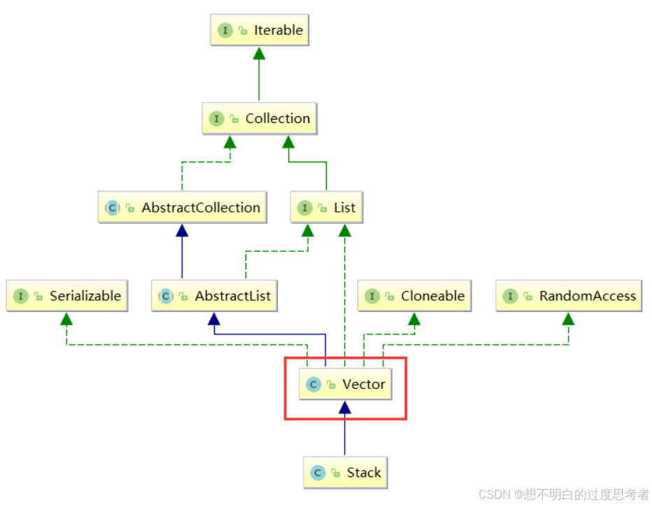
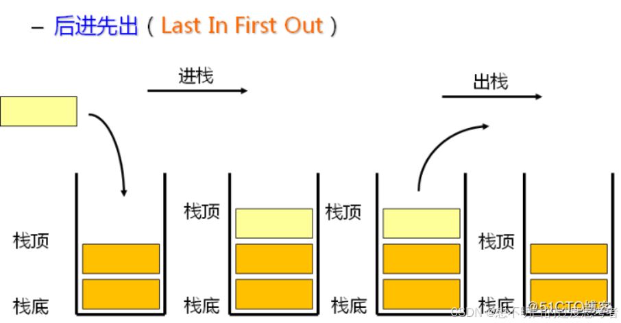
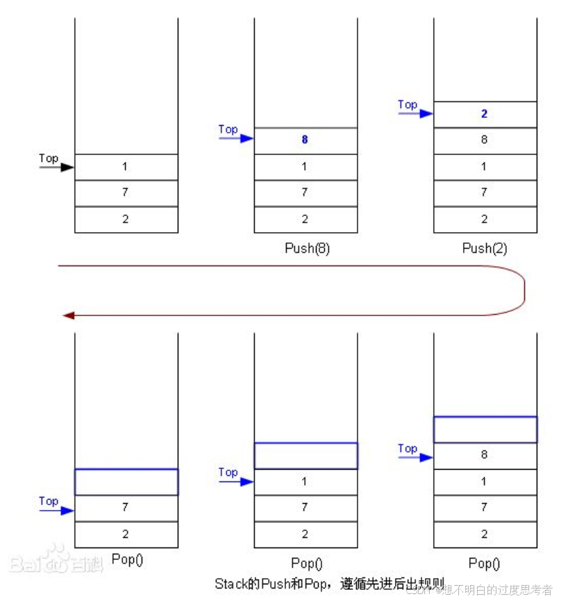
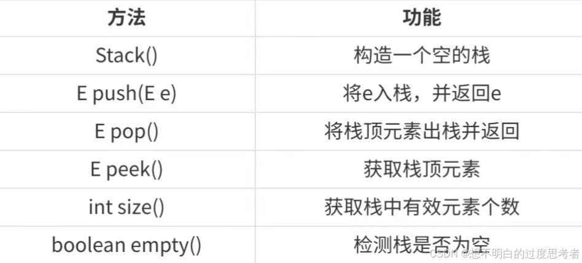
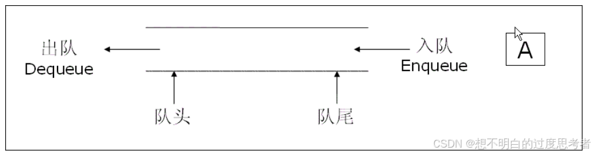
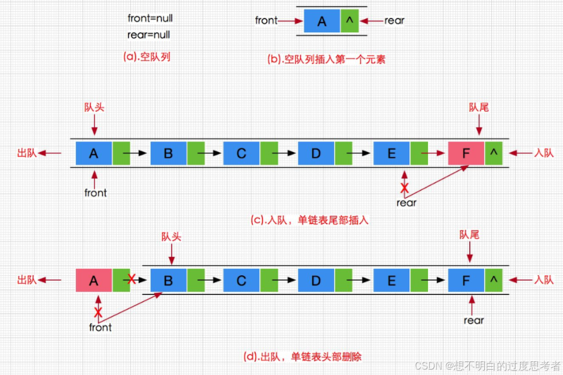
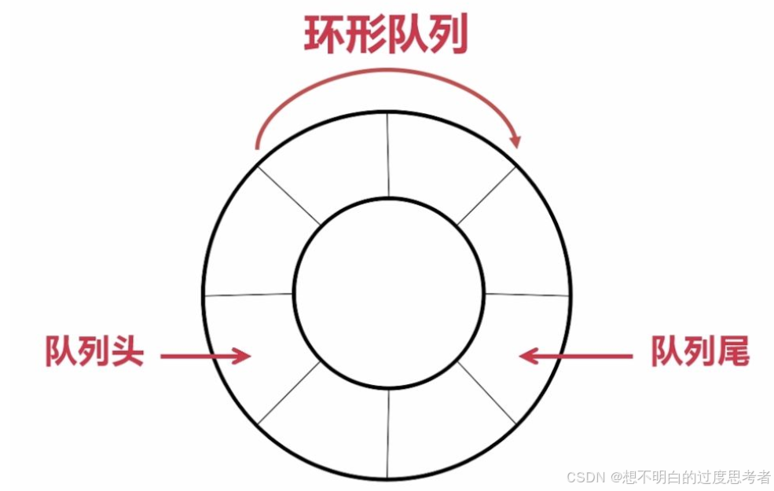
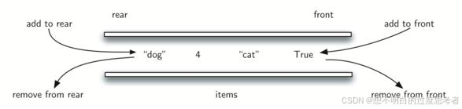

> **[<font face="STCAIYUN" size =  5 color = #386b44ff>数</font><font face="STCAIYUN" size =  5 color = #386b44ff>据</font><font face="STCAIYUN" size =  5 color = #386b44ff>结</font><font face="STCAIYUN" size =  5 color = #386b44ff>构</font><font face="STCAIYUN" size =  5 color = #386b44ff>专</font><font face="STCAIYUN" size =  5 color = #386b44ff>栏 </font>⬅(click)](http://localhost:4321/archive/?category=Java%E6%95%B0%E6%8D%AE%E7%BB%93%E6%9E%84)**


---

## 🌟 引言：当数据结构遇上吃货

想象一下，你有一桶薯片（栈），每次只能从顶部拿一片，最后放进去的薯片总是最先被吃掉（LIFO）。又或者你在奶茶店排队（队列），先来的人先点单，后来的人只能乖乖排后面（FIFO）。这就是栈和队列的日常！今天，我们就用吃货的视角，啃下这两个数据结构！

流程图：


---

## 🥞 栈（Stack）：后进先出的薯片桶

### 🧐 栈是啥？
- **官方定义**：只允许在**栈顶**操作（插入=压栈，删除=出栈）的线性表，遵循**LIFO**（Last In First Out）。
- 压栈：栈的插⼊操作叫做进栈/压栈/⼊栈，⼊数据在栈顶。
- 出栈：栈的删除操作叫做出栈。出数据在栈顶。
- **吃货理解**：一桶薯片，你只能从顶部拿，最后放进去的薯片最先被吃掉！

**图例1：**

**图例2：**


### 📚 栈的操作（Java版）


```java
Stack<Integer> stack = new Stack<>();
stack.push(1); // 压栈：放入一片薯片
stack.peek();  // 瞅一眼栈顶的薯片（但忍住不吃）
stack.pop();   // 出栈：终于吃掉栈顶的薯片！
stack.size();  // 看看桶里还剩几片
```

### 🛠️ 栈的模拟实现：手搓一个薯片桶

```java
public class MyStack {
    int[] array = new int[3]; // 初始容量3，不够吃了就扩容！
    int size = 0;

    // 压栈：薯片塞进桶
    public int push(int e) {
        ensureCapacity(); // 桶满了？换个大桶！
        array[size++] = e;
        return e;
    }

    // 出栈：吃掉最上面的薯片
    public int pop() {
        int e = peek(); // 看一眼栈顶
        size--;         // 薯片-1
        return e;
    }

    // 偷偷瞅一眼栈顶
    public int peek() {
        if (empty()) throw new RuntimeException("桶空了，别看了！");
        return array[size - 1]; // 注意是size-1，不是size=1（老板扣鸡腿！）
    }

    // 扩容：吃货的终极奥义
    private void ensureCapacity() {
        if (size == array.length) {
            array = Arrays.copyOf(array, size * 2); // 容量翻倍，继续囤货！
        }
    }
}
```

---

### 💡 栈的应用：薯片桶能干啥？
1. **反转序列**  
   - 题目：进栈顺序1,2,3,4，哪个出栈顺序不可能？  
   - **答案**：C（3,1,4,2）。因为3出栈后，1不可能在栈顶，早被压在下面了！

2. **逆序打印链表**  
   ```java
   // 递归：系统栈帮你倒着吃薯片
   void printList(Node head) {
       if (head != null) {
           printList(head.next);
           System.out.print(head.val + " ");
       }
   }

   // 循环：手动用栈模拟
   Stack<Node> stack = new Stack<>();
   while (head != null) {
       stack.push(head);
       head = head.next;
   }
   while (!stack.empty()) {
       System.out.print(stack.pop().val + " ");
   }
   ```

---

## 🧋 队列（Queue）：排队买奶茶的哲学

### 🧐 队列是啥？
- **官方定义**：一端入队（队尾），另一端出队（队头），遵循**FIFO**（First In First Out）。
- **奶茶理解**：先来的人先点单，后来的人别插队！
<!--  -->

### 📚 队列的操作（Java版）


```java
Queue<Integer> queue = new LinkedList<>();
queue.offer(1); // 排队：队尾加入
queue.poll();   // 出队：队头的人拿到奶茶了！
queue.peek();   // 偷看队头是谁
```

### 🛠️ 队列的模拟实现：手搓奶茶排队系统
流程示意图


```java
public class MyQueue {
    static class ListNode {
        int value;
        ListNode next;
        ListNode prev;
        ListNode(int value) { this.value = value; }
    }

    ListNode first; // 队头：马上要点单的人
    ListNode last;  // 队尾：刚来排队的萌新
    int size = 0;

    // 入队：萌新乖乖排到队尾
    public void offer(int e) {
        ListNode newNode = new ListNode(e);
        if (first == null) {
            first = last = newNode; // 队列为空，你就是第一个！
        } else {
            last.next = newNode;    // 原队尾指向新节点
            newNode.prev = last;    // 新节点指回原队尾
            last = newNode;         // 更新队尾
        }
        size++;
    }

    // 出队：队头的人拿到奶茶离开
    public int poll() {
        if (first == null) throw new RuntimeException("队都空了，别取了！");
        int value = first.value;
        if (first == last) {
            first = last = null; // 队列只剩一人，清空
        } else {
            first = first.next;  // 队头后移
            first.prev = null;   // 断开头节点的前驱
        }
        size--;
        return value;
    }
}
```

---

### 🔄 循环队列：奶茶店的环形吧台


- **问题**：普通数组实现的队列会“假溢出”，环形队列让队尾和队头循环连接！
- **判断满/空**：  
  - 方法1：用`size`属性记录元素个数。  
  - 方法2：保留一个空位，`rear`的下一个位置是`front`时视为满。  
  - 方法3：用标记`isFull`区分。

```java
// 入队操作（保留一个空位法）
public boolean enQueue(int value) {
    if ((rear + 1) % capacity == front) return false; // 队满
    array[rear] = value;
    rear = (rear + 1) % capacity;
    return true;
}
```

---

## 🎮 双端队列（Deque）：能插队也能反悔的神器


- **定义**：两头都能入队和出队，既是栈又是队列！
- **使用场景**：实现高效的回文检查、滑动窗口等。
- **Java实现**：
  ```java
  Deque<Integer> stack = new ArrayDeque<>(); // 当栈用
  Deque<Integer> queue = new LinkedList<>(); // 当队列用
  ```
  Deque是⼀个接⼝，使⽤时必须创建LinkedList的对象。
  在实际⼯程中，使⽤Deque接⼝是⽐较多的，栈和队列均可以使⽤该接⼝。

---

## 💼 面试经典题
1. **用队列实现栈**：[LeetCode 225](https://leetcode.com/problems/implement-stack-using-queues/)  
   - 核心：让队列的队尾成为栈顶，每次入栈后反转队列前n-1个元素。

2. **用栈实现队列**：[LeetCode 232](https://leetcode.com/problems/implement-queue-using-stacks/)  
   - 核心：用两个栈，一个负责入队，一个负责出队。

---

## 🌈 结语：数据结构与生活的奇妙共鸣
无论是叠盘子（栈）还是排奶茶（队列），数据结构无处不在。下次吃薯片时，不妨想想栈的操作；排队时，回忆队列的哲学。技术源于生活，吃货也能成为算法大师！🍟🚀
