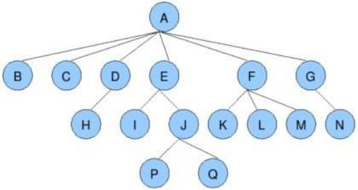
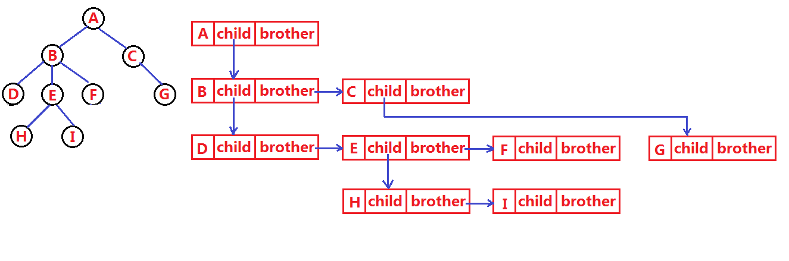
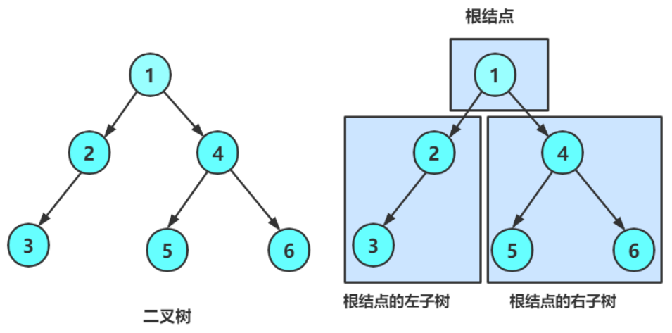
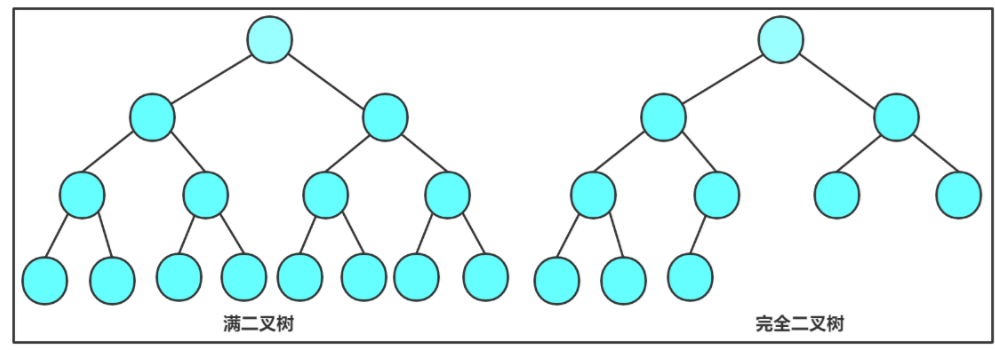
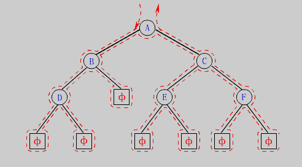
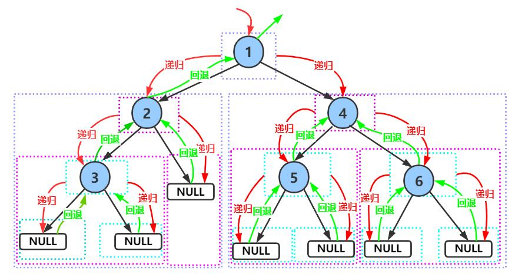

> **[<font face="STCAIYUN" size =  5 color = #386b44ff>数</font><font face="STCAIYUN" size =  5 color = #386b44ff>据</font><font face="STCAIYUN" size =  5 color = #386b44ff>结</font><font face="STCAIYUN" size =  5 color = #386b44ff>构</font><font face="STCAIYUN" size =  5 color = #386b44ff>专</font><font face="STCAIYUN" size =  5 color = #386b44ff>栏 </font>⬅(click)](https://blog.csdn.net/weixin_46491509/category_12935100.html?spm=1001.2014.3001.5482)**
---

## 一、树型结构基础

### 1.1 树的基本概念


**<font size = 5 color = green>树</font>是一种非线性的数据结构，由n(n>0)个有限节点组成一个具有层次关系的集合。它看起来像一棵倒挂的树，根朝上而叶朝下。**

> **关键特点**：
> - 有且仅有一个根节点，没有前驱节点
> - 除根节点外，其余节点被分成M(M>0)个互不相交的子树
> - 树是递归定义的

> **重要术语**：
> - **结点的度**：一个结点含有子树的个数
> - **树的度**：树中所有结点度的最大值
> - **叶子结点**：度为0的结点
> - **双亲结点/父结点**：含有子结点的结点
> - **孩子结点/子结点**：一个结点含有的子树的根结点
> - **根结点**：没有双亲结点的结点
> - **结点的层次**：从根开始定义，根为第1层
> - **树的高度/深度**：树中结点的最大层次

### 1.2 树的表示方法

最常用的表示方法是**孩子兄弟表示法**：

```java
class Node {
    int value;        // 树中存储的数据
    Node firstChild;  // 第一个孩子引用
    Node nextBrother; // 下一个兄弟引用
}
```


## 二、二叉树详解

### 2.1 二叉树概念

二叉树是结点的一个有限集合，该集合：
1. 或者为空
2. 或者由一个根节点加上两棵分别称为左子树和右子树的二叉树组成

**特点**：
- 二叉树不存在度大于2的结点
- 二叉树的子树有左右之分，次序不能颠倒，是有序树


### 2.2 特殊二叉树

1. **满二叉树**：每层的结点数都达到最大值。层数为K，结点总数是2^K-1
2. **完全二叉树**：深度为K，有n个结点的二叉树，当且仅当其每一个结点都与深度为K的满二叉树中编号从0至n-1的结点一一对应


### 2.3 二叉树的性质

1. 非空二叉树的第i层最多有2^(i-1)个结点
2. 深度为K的二叉树最大结点数是2^K-1
3. 对于任何二叉树，n0(叶子结点) = n2(度为2的结点) + 1
4. 具有n个结点的完全二叉树深度为⌈log₂(n+1)⌉
5. 完全二叉树的父子结点关系：
   - 父结点序号：(i-1)/2
   - 左孩子序号：2i+1
   - 右孩子序号：2i+2

### 2.4 二叉树的存储

#### 链式存储

```java
// 孩子表示法
class Node {
    int val;    // 数据域
    Node left;  // 左孩子引用，常常代表左孩⼦为根的整棵左⼦树 
    Node right; // 右孩子引用，常常代表右孩⼦为根的整棵右⼦树 
}

// 孩子双亲表示法
class Node {
    int val;
    Node left;  // 左孩子引用，常常代表左孩⼦为根的整棵左⼦树 
    Node right; // 右孩子引用，常常代表右孩⼦为根的整棵右⼦树 
    Node parent; // 当前节点的根节点
}
```

## 三、二叉树遍历
**<font size = 4 color = brown>遍历(Traversal)</font>是指沿着某条搜索路线，依次对树中每个结点均做⼀次且仅做⼀次访问。访问结点所做的操作依赖于具体的应⽤问题(比如：打印节点内容、节点内容加1)。遍历是⼆叉树上最重要的操作之一，是二叉树上进行其它运算之基础。**


### 3.1 递归遍历

1. **(NLR)前序遍历**：根节点 -> 左子树 -> 右子树
2. **(LNR)中序遍历**：左子树 -> 根节点 -> 右子树
3. **(LRN)后序遍历**：左子树 -> 右子树 -> 根节点


```java
// 前序遍历
void preOrder(Node root) {
    if (root == null) return;
    System.out.print(root.val + " ");
    preOrder(root.left);
    preOrder(root.right);
}

// 中序遍历
void inOrder(Node root) {
    if (root == null) return;
    inOrder(root.left);
    System.out.print(root.val + " ");
    inOrder(root.right);
}

// 后序遍历
void postOrder(Node root) {
    if (root == null) return;
    postOrder(root.left);
    postOrder(root.right);
    System.out.print(root.val + " ");
}
```

### 3.2 层序遍历

从根节点出发，按层次从上到下、从左到右访问结点。

```java
void levelOrder(Node root) {
    if (root == null) return;
    Queue<Node> queue = new LinkedList<>();
    queue.offer(root);
    while (!queue.isEmpty()) {
        Node cur = queue.poll();
        System.out.print(cur.val + " ");
        if (cur.left != null) queue.offer(cur.left);
        if (cur.right != null) queue.offer(cur.right);
    }
}
```

## 四、二叉树基本操作
**代码示例：**
```java
// 获取节点个数
int size(Node root) {
    if (root == null) return 0;
    return 1 + size(root.left) + size(root.right);
}

// 获取叶子节点个数
int getLeafNodeCount(Node root) {
    if (root == null) return 0;
    if (root.left == null && root.right == null) return 1;
    return getLeafNodeCount(root.left) + getLeafNodeCount(root.right);
}

// 获取第k层节点个数
int getKLevelNodeCount(Node root, int k) {
    if (root == null || k <= 0) return 0;
    if (k == 1) return 1;
    return getKLevelNodeCount(root.left, k-1) + getKLevelNodeCount(root.right, k-1);
}

// 获取二叉树高度
int getHeight(Node root) {
    if (root == null) return 0;
    return 1 + Math.max(getHeight(root.left), getHeight(root.right));
}

// 查找值为val的节点
Node find(Node root, int val) {
    if (root == null) return null;
    if (root.val == val) return root;
    Node left = find(root.left, val);
    if (left != null) return left;
    return find(root.right, val);
}
```

## 结语

**二叉树是数据结构中的核心内容，掌握好二叉树对于理解更复杂的数据结构和算法至关重要。建议读者在学习理论的同时，多动手实现代码，解决实际问题，才能真正掌握二叉树的精髓。**
   
   ---