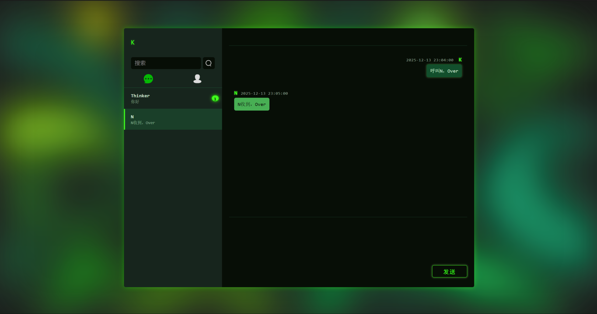

# 🚀 Java Chatroom - 基于Spring Boot的实时聊天系统

在当今互联网时代，实时通信已成为许多应用的核心功能之一。今天我要向大家介绍一个基于Spring Boot和WebSocket技术实现的轻量级实时聊天室项目——Java Chatroom。

## <font color=greenf>现成网页聊天室使用说明（请在使用前务必看这里！！！）</font>


<a href="http://114.132.122.97:8080/login.html">网络聊天室(已部署，需要用电脑打开！（前端没做响应式设计）) ⬅ Click here</a>


**- 此项目暂未完善添加好友功能，因此就算注册了新用户也无法和任何人聊天，只能在我这边往数据添加好友数据才行（也可以跟我说你的用户名，我可以查到并且帮你连接对应的好友）**
**- 因此我在这里提供两个匿名账号谁都可以用（里面的好友只有我 K ），由于设置了禁止多开功能，最多同时只能有一个账号登录！如果发现登录不上了，可能是有人正在登录占用着，如果不再使用的话请及时登出:）**


**- 用户名：Thinker  密码：12208**

**- 用户名：Thinker2  密码：12208**

虽然这样的操作有点像脱裤子放屁（鉴定为真），微信QQ不香吗？毕竟有谁会处于一个——身边没有手机，只有一台电脑（没做响应式设计😅），电脑有网，但是没有聊天工具，且想和人聊天的情况...

但是由于本人的能力以及时间有限，需要以后有时间才能完善，请谅解！


---

## 🌟 项目简介

Java Chatroom是一个采用前后端分离架构的Web聊天应用，专注于提供稳定、实时的消息通信平台。它支持用户认证、好友管理和一对一私聊等核心功能。



## 🛠️ 技术栈

本项目采用了现代化的技术栈，包括：

- **后端框架**：Spring Boot 2.7.6
- **实时通信**：Spring WebSocket
- **数据访问**：MyBatis
- **数据库**：MySQL
- **构建工具**：Maven
- **前端技术**：HTML/CSS/JavaScript + jQuery

## 🏗️ 系统架构

项目采用经典的三层架构（Controller/Service/Dao）配合WebSocket的通信模型，整体架构清晰，易于维护和扩展。

### 核心通信流程

1. 用户通过HTTP `/login` 登录成功后，获取会话信息
2. 用户发起WebSocket连接请求到 `/WebSocketMessage`
3. 服务器将用户ID和对应的WebSocket会话(Session)绑定存储
4. 用户A发送消息到服务器（通过WebSocket）
5. 服务器根据消息中的目标用户ID查找对应的WebSocket Session
6. 服务器通过目标Session将消息实时推送给用户B

## 🗃️ 数据库设计

系统采用5个核心数据表来实现用户关系和消息存储：

1. **user表**：存储用户基本信息
2. **friend表**：记录用户好友关系
3. **message_session表**：会话信息
4. **message_session_user表**：会话用户关联（支持扩展群聊）
5. **message表**：具体的消息内容

## 🎯 核心功能模块

### 用户认证系统
- 用户注册新账号
- 基于会话的登录校验

### 实时通信
- 利用WebSocket实现消息的毫秒级推送
- 支持一对一私密聊天

### 消息与会话管理
- 自动管理私聊会话的创建与激活
- 持久化存储消息记录，支持查看历史消息

### 好友关系
- 展示当前用户的好友列表

## 📁 项目结构

```
java_chatroom/
├── src/
│   ├── main/
│   │   ├── java/com/example/java_chatroom/
│   │   │   ├── api/           # 控制器层
│   │   │   ├── component/     # 组件类
│   │   │   ├── config/        # 配置类
│   │   │   └── model/         # 数据模型
│   │   ├── resources/
│   │   │   ├── mapper/        # MyBatis XML映射文件
│   │   │   └── static/        # 前端静态资源
│   │   └── db.sql             # 数据库初始化脚本
├── pom.xml                    # Maven依赖配置
└── README.md                  # 项目说明文档
```

## 🚀 部署与运行

### 项目仓库
::github{repo="OverThinker13/OverThinker_ChatRoom"}

### 环境要求
- JDK 1.8或更高版本
- MySQL 5.7或更高版本
- Maven 3.6或更高版本

### 运行步骤
1. 克隆项目并进入目录
2. 初始化数据库：
   ```bash
   mysql -u root -p < src/main/java/db.sql
   ```
3. 修改`application.yml`中的数据库连接信息
4. 运行项目：
   ```bash
   mvn clean install
   mvn spring-boot:run
   ```
5. 访问应用：`http://127.0.0.1:8080/login.html`

## 💡 Future Enhancements (未来展望)

本项目可进一步扩展以实现更丰富的功能：

  * **好友请求功能:** 实现用户搜索、发送/接受好友请求的完整流程 (当前需手动修改 DB)。
  * **个性化展示:** 用户添加头像，个性签名等。
  * **群聊支持:** 扩展会话模型，支持多人聊天室和群组管理。
  * **消息类型扩展:** 支持发送图片、文件和表情包。
  * **用户状态管理:** 实时显示用户的在线/离线状态和最后活跃时间。
  * **UI/UX 优化:** 引入更现代的前端框架或库，实现响应式设计。